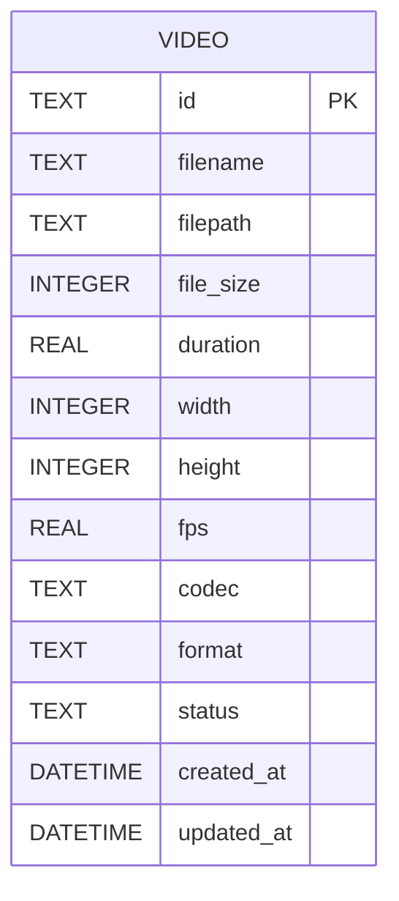

# REASONS Canvas: Video Upload & Management
Date: 2026-07-14
Analysis: analysis/2026-07-14-video-upload-management-analysis.md
Scope: full-stack

---

## R — Requirements

**Problem:** There is no way to bring video files into the system. Every editing
feature in Stories 3–10 depends on a video being stored, probed, and recorded in
the database. Without a validated, metadata-rich upload pipeline, all downstream
features have nothing to work with.

**Goal:** Allow a user to drag-and-drop or pick a video file, have it validated
by format and size, probed by FFmpeg for duration/resolution/fps/codec, stored
to disk, and recorded in SQLite — then display the upload progress and the
returned metadata in the UI.

**Definition of Done:**
- [ ] Given a user uploads a valid `.mp4`, `.mov`, `.avi`, `.mkv`, or `.webm` file under the size limit, when the upload completes, then HTTP 200 is returned with a JSON body containing the video id, filename, duration, width, height, fps, codec, format, and status "ready".
- [ ] Given a valid upload completes, when the server responds, then the file is physically present in `storage/uploads/` and a matching record exists in the `videos` table.
- [ ] Given a user uploads a file with an unsupported extension (e.g. `.pdf`, `.txt`, `.exe`), when the server receives the request, then HTTP 422 is returned with an error message identifying the unsupported format — no file is written to disk.
- [ ] Given a user uploads a file exceeding `MAX_UPLOAD_SIZE_MB`, when the server receives the request, then HTTP 413 is returned with a size-limit error message — no file is written to disk.
- [ ] Given a user uploads a file that is corrupt or unreadable by FFmpeg, when the probe step fails, then the saved file is deleted, HTTP 422 is returned, and no DB record is created.
- [ ] Given a video record exists, when `GET /api/v1/videos/{id}` is called, then HTTP 200 is returned with the full metadata JSON for that video.
- [ ] Given a video id does not exist in the database, when `GET /api/v1/videos/{id}` is called, then HTTP 404 is returned.
- [ ] Given a video record exists, when `DELETE /api/v1/videos/{id}` is called, then HTTP 200 is returned, the file is removed from `storage/uploads/`, and the DB record is deleted.
- [ ] Given the frontend upload is in progress, when the file transfer is underway, then the progress bar increments in real time from 0% to 100%.
- [ ] Given `MAX_UPLOAD_SIZE_MB` is set in `.env`, when a file exceeds that value, then the rejection threshold matches the configured value — no hardcoded limit exists in the source code.

---

## E — Entities

### Data Entities

| Entity | Type | Key Fields | Relationships |
|--------|------|-----------|---------------|
| Video | New SQLAlchemy model | id (UUID TEXT PK), filename, filepath, file_size, duration, width, height, fps, codec, format, status, created_at, updated_at | None in Story 2; future stories add foreign keys pointing to videos.id |
| VideoStatus | New Python enum | uploaded, processing, ready, error | Used as the Video.status column value |

### Frontend Artifacts

| Name | Type | Path | Responsibility |
|------|------|------|----------------|
| `Video`, `VideoStatus`, `UploadState` | TypeScript types | `src/types/index.ts` | Typed shapes for video metadata and upload UI state; added to the existing types file |
| `uploadVideo()` | API function | `src/api/client.ts` | XMLHttpRequest-based multipart upload; accepts a File and an onProgress callback; returns a Promise resolving to VideoResponse |
| `deleteVideo()` | API function | `src/api/client.ts` | Wraps the existing `api.delete` call for the videos endpoint |
| `ProgressBar` | React component | `src/components/common/ProgressBar.tsx` | Generic reusable progress bar driven by a 0–100 percent prop; placed in common because Stories 4 and 8 will reuse it |
| `UploadZone` | React component | `src/components/upload/UploadZone.tsx` | Drag-and-drop area with file-picker fallback; validates file extension client-side before calling the API; emits the selected File to its parent |
| `UploadPage` | React page | `src/pages/UploadPage.tsx` | Composes UploadZone and ProgressBar; drives upload via React Query useMutation; displays returned metadata on success and a descriptive error message on failure |

---

## A — Approach

**Pattern:** FastAPI Service layer (backend) + React Query useMutation (frontend).

**Strategy:** Keep route handlers thin — they handle HTTP concerns only (Content-Length
pre-check, file extension validation, response serialisation) and delegate all
business logic to `VideoService`. `VideoService` owns the ordered flow: validate
format, validate size, save to disk with aiofiles, probe with `FFmpegService`,
create the DB record, and clean up the file on any failure. `FFmpegService`
wraps `ffprobe` as an async subprocess so it never blocks the event loop; it is
isolated so Stories 6, 8, and 10 can reuse it without modification. On the
frontend, `uploadVideo()` uses `XMLHttpRequest` (not `fetch`) exclusively for
its `upload.onprogress` event, wrapped in a Promise so it looks like any other
async call at the component level. React Query's mutation state drives all UI
transitions — no parallel manual loading flags.

**Scope In:**
- Three API endpoints: POST /upload, GET /{id}, DELETE /{id}
- Video SQLAlchemy model and its DB table via create_all
- VideoStatus enum (uploaded, processing, ready, error)
- VideoCreate and VideoResponse Pydantic schemas
- VideoService orchestrating the upload business flow
- FFmpegService.probe() as an async subprocess wrapping ffprobe
- File format validation (extension + basic MIME check)
- File size pre-check via Content-Length header, secondary byte-count during streaming
- Disk write using aiofiles to avoid blocking the event loop
- Cleanup of saved file when FFmpeg probe fails
- Drag-and-drop upload zone with client-side extension validation
- Real-time progress bar driven by XHR upload events
- Success state displaying returned video metadata
- Descriptive error states for format rejection, size rejection, and corrupt file

**Scope Out:**
- No video listing or library page (Story 3)
- No byte-range streaming or in-browser playback (Story 3)
- No thumbnail generation (Story 3)
- No transcription, subtitles, silence, or filler word detection (Stories 4–7)
- No export or rendering pipeline (Story 8)
- No background job queue — the FFmpeg probe runs synchronously within the request (Story 4 introduces jobs)
- No batch or multi-file upload
- No chunked or resumable upload
- No user authentication or per-user storage isolation
- No MKV container subtitle track extraction

---

## S — Structure

### API Structure

**Root:** `backend/app/`

**API Endpoints:**
- Method: POST — Path: `/api/v1/videos/upload` — Auth: none (Story 9 adds auth)
- Method: GET — Path: `/api/v1/videos/{id}` — Auth: none
- Method: DELETE — Path: `/api/v1/videos/{id}` — Auth: none

**New Files:**
- `backend/app/models/video.py` — VideoStatus enum and Video SQLAlchemy ORM model with all columns per the plan schema
- `backend/app/schemas/video.py` — VideoCreate (internal DTO from FFmpeg probe output) and VideoResponse (API-facing serialisation of a Video model instance)
- `backend/app/services/ffmpeg.py` — FFmpegService class with an async probe() method that runs ffprobe via asyncio.create_subprocess_exec and parses its JSON output into a structured dict
- `backend/app/services/video.py` — VideoService class with methods: validate_format(), validate_size(), save_file(), create_record(), get_by_id(), delete(); orchestrates the full upload flow
- `backend/app/api/v1/videos.py` — APIRouter with three handlers: POST /upload (Content-Length check → delegate to VideoService → return VideoResponse), GET /{id} (delegate to VideoService → 200 or 404), DELETE /{id} (delegate to VideoService → 200)
- `backend/tests/test_videos.py` — pytest tests for all acceptance criteria: valid upload, invalid format, size exceeded, corrupt file, GET found, GET not found, DELETE

**Modified Files:**
- `backend/app/main.py` — import Video model (so create_all sees the table) and register the videos router at prefix `/api/v1/videos`
- `backend/app/models/__init__.py` — import Video model to make it importable from the models package

**Database:**
- No migration file — `Base.metadata.create_all()` already runs in `init_db()` at startup; importing the Video model before that call is sufficient to create the `videos` table automatically

### Frontend Structure

**Root:** `frontend/src/`

**New Files:**
- `frontend/src/components/common/ProgressBar.tsx` — reusable progress bar component accepting a percent prop (0–100) and an optional label; uses Tailwind for styling
- `frontend/src/components/upload/UploadZone.tsx` — drag-and-drop zone with file-picker fallback; validates extension client-side; calls the onFile prop with the selected File object
- `frontend/src/pages/UploadPage.tsx` — page component composing UploadZone and ProgressBar; uses useMutation from React Query with uploadVideo(); handles pending/success/error states

**Modified Files:**
- `frontend/src/types/index.ts` — add Video interface, VideoStatus type union, and UploadState interface to the existing file
- `frontend/src/api/client.ts` — add uploadVideo() using XMLHttpRequest with upload.onprogress; add deleteVideo() wrapping api.delete
- `frontend/src/App.tsx` — add Route path="/upload" element=UploadPage
- `frontend/src/components/common/Layout.tsx` — add "Upload" navigation link in the header alongside the existing logo

---

## O — Operations

1. [BE] Create `backend/app/models/video.py` — define VideoStatus as a Python StrEnum with values uploaded, processing, ready, and error; define the Video SQLAlchemy model inheriting from Base with all columns: id as a UUID stored as TEXT primary key, filename and filepath as non-nullable TEXT, file_size as non-nullable INTEGER, duration as REAL, width and height as INTEGER, fps as REAL, codec and format as TEXT, status as TEXT defaulting to "uploaded", created_at and updated_at as DATETIME with server defaults

2. [BE] Modify `backend/app/models/__init__.py` — import the Video class so it is accessible as `from app.models import Video` throughout the codebase

3. [BE] Modify `backend/app/main.py` — add an import of `app.models.video` (or `from app.models import Video`) before the `init_db()` call in the lifespan function so SQLAlchemy's metadata registry knows about the videos table when create_all runs; also add the videos router include with prefix `/api/v1/videos` and tag "videos"

4. [BE] Create `backend/app/schemas/video.py` — define VideoCreate as a Pydantic BaseModel with fields for filename, filepath, file_size, duration, width, height, fps, codec, and format (all sourced from FFmpeg probe output); define VideoResponse as a Pydantic model with all Video table columns including id, status, created_at, and updated_at, configured with model_config from_attributes=True so it can be constructed directly from an ORM instance

5. [BE] Create `backend/app/services/ffmpeg.py` — define FFmpegService as a class with an async static method probe() that accepts a filepath string; it runs ffprobe with flags for quiet output, JSON format, and full stream and format data using asyncio.create_subprocess_exec; it reads stdout and stderr, decodes the JSON, extracts duration from format section and width/height/fps/codec from the first video stream; it raises a ValueError with a descriptive message if ffprobe exits non-zero or if no video stream is found; it never uses subprocess.run or any blocking call

6. [BE] Create `backend/app/services/video.py` — define VideoService as a class with the following methods: validate_format() checks the file extension against the allowed set and raises HTTPException 422 if unsupported; validate_size() checks the declared byte count against settings.max_upload_size_bytes and raises HTTPException 413 if exceeded; save_file() writes the uploaded file bytes to a UUID-named path under settings.uploads_path using aiofiles and returns the saved path; create_record() inserts a Video row into the database using the session from get_db and returns the new Video ORM instance; delete() removes the file from disk (ignoring missing-file errors) and deletes the DB row; the upload() method composes these in order: validate_format → validate_size → save_file → FFmpegService.probe() in a try block with a finally that deletes the saved file if probe raises → create_record with status "ready" → return VideoResponse

7. [BE] Create `backend/app/api/v1/videos.py` — define an APIRouter; POST /upload handler accepts an UploadFile and checks the Content-Length request header against settings.max_upload_size_bytes before reading the body (return 413 immediately if exceeded), then calls VideoService.upload() and returns a VideoResponse; GET /{id} handler queries the videos table by id and returns VideoResponse or raises HTTPException 404 with message "Video not found"; DELETE /{id} handler queries the record, calls VideoService.delete(), and returns a JSON body confirming deletion

8. [BE] Create `backend/tests/test_videos.py` — following the same class-per-scenario pattern as test_health.py; TestVideoUpload covers: valid mp4 returns 200 with all metadata fields, valid mov and avi also accepted, pdf rejected with 422, file over size limit rejected with 413, corrupt file (mock FFmpegService.probe to raise) rejected with 422 and no DB record left; TestVideoGet covers: existing id returns 200 with correct fields, unknown id returns 404; TestVideoDelete covers: existing id deletes file and record and returns 200, unknown id returns 404; all tests use the session-scoped client fixture from conftest.py; file I/O and FFmpeg calls are mocked with unittest.mock.patch

9. [FE] Modify `frontend/src/types/index.ts` — append three new exports: VideoStatus as a type union of "uploaded" | "processing" | "ready" | "error"; Video as an interface with all fields returned by VideoResponse (id, filename, file_size, duration, width, height, fps, codec, format, status, created_at, updated_at); UploadState as an interface with fields file (File or null), progress (number 0–100), and result (Video or null)

10. [FE] Modify `frontend/src/api/client.ts` — add uploadVideo() as a named export that accepts a File object and an onProgress callback of type (percent: number) => void; inside it creates an XMLHttpRequest, sets the upload.onprogress handler to compute and pass the percentage from event.loaded divided by event.total multiplied by 100, opens a POST to the /api/v1/videos/upload path constructed from the same BASE_URL constant, appends the file to a FormData object under the key "file" with no explicit Content-Type header so the browser sets the multipart boundary automatically, and wraps the whole thing in a Promise that resolves with the parsed JSON VideoResponse on load or rejects with an Error on network failure or non-200 status; also add deleteVideo() as a thin wrapper over api.delete for the /api/v1/videos/{id} path

11. [FE] Create `frontend/src/components/common/ProgressBar.tsx` — a React functional component accepting props percent (number) and an optional label (string); renders a labelled progress track div with a filled inner div whose width is set to the percent value as an inline style; styled with Tailwind using the same gray/violet color palette as the rest of the UI; exported as the default export

12. [FE] Create `frontend/src/components/upload/UploadZone.tsx` — a React functional component accepting an onFile prop of type (file: File) => void and a disabled boolean; renders a bordered dashed drop zone that handles dragover, dragleave, and drop events; on drop or on file-input change it reads the first selected file, checks its extension against the allowed list, and either calls onFile or sets a local validation error state; shows the selected file name and size when a file is chosen; shows the validation error inline without making any network call; styled with Tailwind in the project's dark theme

13. [FE] Create `frontend/src/pages/UploadPage.tsx` — a React page component that holds a single useMutation from React Query configured with the uploadVideo mutationFn and local progress state updated via the onProgress callback; renders UploadZone passing the mutate function as the onFile handler and disabled=true while the mutation is pending; renders ProgressBar passing the progress state value while isPending is true; on isSuccess renders a summary card displaying the returned Video metadata fields (filename, duration, resolution, fps, codec, format, file size); on isError renders an error banner with the error message; uses Layout for the page shell

14. [FE] Modify `frontend/src/App.tsx` — add an import for UploadPage and a new Route with path="/upload" and element=UploadPage alongside the existing Dashboard route

15. [FE] Modify `frontend/src/components/common/Layout.tsx` — add an "Upload" navigation link in the header using react-router-dom Link, styled consistently with the existing header elements, pointing to "/upload"

---

## N — Norms

### API Norms

- FastAPI module path: `backend/app/` with sub-packages core/, api/v1/, models/, schemas/, services/, workers/
- All config values come from the pydantic `settings` singleton — never from os.environ directly
- Database sessions are obtained exclusively via the `get_db()` Depends — never instantiated inline
- All file paths use `pathlib.Path` — no string concatenation with slashes
- Logging uses the configured logger (`logging.getLogger(__name__)`) — no print statements
- Router files define only HTTP handlers — business logic lives in services/
- SQLAlchemy models are registered on Base before init_db() is called — import Video before calling init_db in main.py
- New environment variables must be added to both `.env.example` and the `Settings` class in `config.py`
- Async file I/O uses `aiofiles` — never open() in an async context
- Long-running external tool calls (FFmpeg) must use asyncio subprocess, never subprocess.run

### Frontend Norms

- All API calls go through `src/api/client.ts` — no raw fetch or XHR calls in components
- Environment variables must be prefixed with `VITE_` to be accessible in the browser bundle
- Path imports use the `@/` alias — no relative `../../` chains
- Server state is managed with TanStack React Query — useMutation for writes, useQuery for reads
- All components are typed with explicit prop interfaces — no implicit any
- Components handle loading, empty, and error states explicitly — no silent failures
- Page components are placed in `src/pages/`, reusable UI in `src/components/`
- Drag-and-drop file handling must include a visible keyboard-accessible fallback (file picker button)

---

## S — Safeguards

### API Safeguards

- FFmpeg probe must run via asyncio.create_subprocess_exec — never subprocess.run or subprocess.Popen — to avoid blocking the event loop under concurrent requests
- The saved file must be deleted in a try/finally block around the FFmpeg probe call — no orphaned files on any error path, including unexpected exceptions
- Content-Length header check must happen before accepting the file body — do not read the full multipart stream just to discover it is too large
- Secondary byte-count guard must be applied during streaming in case Content-Length is absent or spoofed
- HTTPException must be raised with the correct status code: 413 for size, 422 for format and corrupt file — do not use 400 generically
- Video id columns must use uuid4() generated in Python, not database auto-increment — consistent with all future tables
- File paths stored in the DB must use forward slashes (Path.as_posix()) for cross-platform consistency
- The videos router must be imported and included in main.py before the application starts serving requests — missing include causes silent 404s with no error log
- All new test mocks must patch at the module where the symbol is used (app.api.v1.videos or app.services.video), not where it is defined

### Frontend Safeguards

- uploadVideo() must use XMLHttpRequest, not fetch — fetch has no upload.onprogress event; using fetch silently produces a static progress bar
- The Content-Type header must NOT be set manually on the XHR request — setting it breaks the multipart boundary that the browser generates automatically, causing the server to reject the file
- UploadZone must perform client-side extension validation before calling the API — this gives instant feedback and prevents a wasted round trip for obviously wrong files
- The upload button or drop zone must be disabled while a mutation is in-flight — prevents duplicate submissions
- ProgressBar must be placed in src/components/common/ not src/components/upload/ — Stories 4 and 8 will reuse it; placing it in upload/ would require moving it later
- Error messages from the server must be surfaced to the user — never swallowed silently; the XHR rejection reason must be displayed in the UI
- File size display in the success card should use human-readable units (KB, MB) — not raw bytes

---

## Change Log

- 2026-07-14: Canvas created from analysis/2026-07-14-video-upload-management-analysis.md
