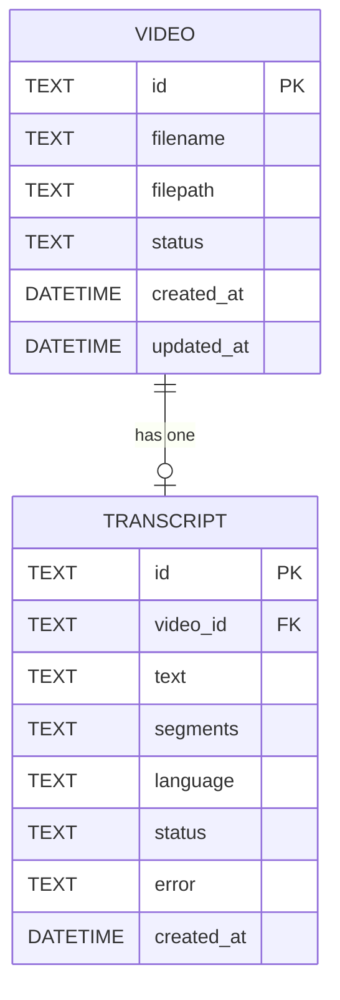

# REASONS Canvas: AI Transcription
Date: 2026-07-15
Analysis: analysis/2026-07-15-ai-transcription-analysis.md
Scope: full-stack

---

## R — Requirements

**Problem:** After a video is uploaded there is no way to get a textual representation of its content. Every downstream workflow — captions (Story 5), silence detection (Story 6), filler-word removal (Story 7), and AI editing (Stories 9–10) — requires a transcript with timestamps, but no transcription capability exists yet.

**Goal:** Allow a creator to trigger AI transcription of any uploaded video, observe real-time progress over a WebSocket, and retrieve a persisted transcript (full text + segment timestamps) once complete.

**Definition of Done:**
- [ ] Given a video with status `uploaded`, when I POST to `/api/v1/videos/{id}/transcribe`, then the server returns 202 Accepted with `{"job": "started", "video_id": "<id>"}` and the video's status changes to `processing`.
- [ ] Given transcription is running, when I connect to `WS /api/v1/videos/{id}/transcribe/ws`, then I receive JSON messages `{"progress": <0–100>, "status": "processing"}` at intervals, and a final `{"progress": 100, "status": "completed"}` when done.
- [ ] Given transcription has completed, when I `GET /api/v1/videos/{id}/transcript`, then the response includes `text` (non-empty string) and `segments` (array of objects each with `start`, `end`, and `text`).
- [ ] Given transcription has completed, when I query the database directly, then a `transcripts` record exists with the correct `video_id`, non-empty `text`, non-empty `segments` JSON, and `status = "completed"`.
- [ ] Given a CUDA-capable GPU is present, when transcription runs, then Faster-Whisper initialises without error; on a CPU-only machine it also initialises without error.
- [ ] Given transcription fails (e.g. unreadable audio), when the error is raised, then the video status is set to `error`, the transcript record has `status = "error"` and a non-empty `error` field, and the WebSocket sends `{"progress": 0, "status": "error", "detail": "<message>"}`.
- [ ] Given transcription is already in progress for a video, when I POST to transcribe again, then the server returns 409 Conflict with `{"detail": "Transcription already in progress"}`.
- [ ] Given the frontend Library page, when a video has status `uploaded`, then a Transcribe button is visible; when `processing`, a live progress bar replaces the button; when `ready` and a transcript exists, a "View Transcript" toggle is shown.
- [ ] Backend tests written and passing covering all above scenarios.
- [ ] No regression in existing upload, list, stream, delete, or health endpoints.

---

## E — Entities

### Data Entities

| Entity | Type | Key Fields | Relationships |
|--------|------|-----------|---------------|
| Video | Existing SQLAlchemy model | id, status (updated: processing → ready/error) | Has one Transcript |
| Transcript | New SQLAlchemy model | id, video_id (FK → videos.id), text, segments (JSON text), language, status, error, created_at | Belongs to Video |
| TranscriptStatus | New Python enum | processing, completed, error | Used by Transcript |

### Frontend Artifacts

| Name | Type | Path | Responsibility |
|------|------|------|----------------|
| `TranscriptSegment` | TypeScript interface | `src/types/index.ts` | Shape of one timed segment: `{ start, end, text }` |
| `Transcript` | TypeScript interface | `src/types/index.ts` | Full transcript DTO: `{ id, video_id, text, segments, language, status, created_at }` |
| `transcribeVideo(id)` | API client function | `src/api/client.ts` | POST to start transcription; returns `{ job, video_id }` |
| `getTranscript(id)` | API client function | `src/api/client.ts` | GET saved transcript; returns `Transcript` |
| `createTranscriptionSocket(id)` | API client function | `src/api/client.ts` | Constructs and returns a `WebSocket` to the progress WS endpoint |
| `TranscriptPanel` | React component | `src/components/library/TranscriptPanel.tsx` | Renders full text block + scrollable segment list with formatted timestamps |
| `VideoCard` (extended) | React component | `src/components/library/VideoCard.tsx` | Adds Transcribe button, progress bar zone, and View Transcript toggle |

---

## A — Approach

**Pattern:** FastAPI `BackgroundTasks` + `asyncio.to_thread` (backend) · `useEffect` WebSocket + TanStack Query `useMutation` / `useQuery` (frontend).

**Strategy:** The POST handler creates a per-video `asyncio.Queue` in a module-level dict before dispatching the background task — ensuring the queue exists before any WebSocket client can connect. The background task runs Faster-Whisper's synchronous generator inside `asyncio.to_thread`; from within that thread it calls `loop.call_soon_threadsafe(queue.put_nowait, msg)` to push progress messages back onto the event loop's queue safely. The WebSocket endpoint drains the same asyncio queue and streams each message to the browser. The `Transcript` model is a new table following the same SQLAlchemy `Base` + `init_db` pattern already in place, with `segments` stored as a JSON string (SQLite has no native JSON column; decoded by the Pydantic schema). On the frontend, `VideoCard` opens a WebSocket inside a `useEffect` when `video.status === "processing"` and tears it down on unmount; after receiving the `completed` message it calls `queryClient.invalidateQueries(['videos'])` to refresh status from the server.

**Scope In:**
- `POST /api/v1/videos/{id}/transcribe` — returns 202, sets status to processing, enqueues background task
- `GET /api/v1/videos/{id}/transcript` — returns saved `TranscriptResponse`
- `WS /api/v1/videos/{id}/transcribe/ws` — streams progress 0–100 and completion/error status
- `Transcript` SQLAlchemy model and `transcripts` table (auto-created by `init_db`)
- `TranscriptionService` wrapping Faster-Whisper with `device="auto"`
- 409 guard via module-level `_in_flight` set
- Video `status` lifecycle: processing → ready / error
- Frontend Transcribe button, ProgressBar zone, TranscriptPanel, WebSocket effect in VideoCard
- Backend tests: POST, GET, WS, 409, error state, DB persistence

**Scope Out:**
- SRT / VTT subtitle file export (Story 5)
- Silence or filler-word detection using the transcript (Stories 6–7)
- Speaker diarization
- Language selection UI — Faster-Whisper auto-detects
- Custom Whisper model selection UI — model name comes from `settings.whisper_model`
- Word-level timestamps — segment-level only
- Translation

---

## S — Structure

### API Structure

**Root:** `backend/app/`

**API Endpoints:**
- Method: POST — Path: `/api/v1/videos/{id}/transcribe` — Auth: none — Returns: 202 `{"job": "started", "video_id": "<id>"}`
- Method: GET — Path: `/api/v1/videos/{id}/transcript` — Auth: none — Returns: `TranscriptResponse`
- Method: WS — Path: `/api/v1/videos/{id}/transcribe/ws` — Auth: none — Streams: `{"progress": int, "status": str}`

**New Files:**
- `backend/app/models/transcript.py` — `TranscriptStatus` enum + `Transcript` ORM model
- `backend/app/schemas/transcript.py` — `TranscriptSegment` + `TranscriptResponse` Pydantic v2 schemas
- `backend/app/services/transcription.py` — `TranscriptionService` with Faster-Whisper integration
- `backend/app/api/v1/transcriptions.py` — three routes + `_queues` dict + `_in_flight` set
- `backend/tests/test_transcription.py` — all transcription-related tests

**Modified Files:**
- `backend/requirements.txt` — add `faster-whisper`
- `backend/app/models/__init__.py` — re-export `Transcript` alongside `Video`
- `backend/app/main.py` — import and register the transcriptions router

**Database:**
- No migration file — `transcripts` table is created automatically by `init_db()` via `Base.metadata.create_all`; `Transcript` must be imported before `init_db()` runs

### Frontend Structure

**Root:** `frontend/src/`

**New Files:**
- `frontend/src/components/library/TranscriptPanel.tsx` — transcript display component

**Modified Files:**
- `frontend/src/types/index.ts` — add `TranscriptSegment` and `Transcript` interfaces
- `frontend/src/api/client.ts` — add `transcribeVideo`, `getTranscript`, `createTranscriptionSocket`
- `frontend/src/components/library/VideoCard.tsx` — add transcription state + WebSocket effect + conditional zones

---

## O — Operations

1. [BE] Modify `backend/requirements.txt` — add `faster-whisper` on its own line; add a comment above it noting that GPU support requires a CUDA-enabled build of `ctranslate2` installed separately and that `faster-whisper` alone is sufficient for CPU-only use

2. [BE] Create `backend/app/models/transcript.py` — define `TranscriptStatus` as a class inheriting from both `str` and `Enum` (Python 3.9 pattern, not `StrEnum`) with three values: `processing`, `completed`, and `error`; define `Transcript` as a SQLAlchemy ORM class inheriting from `Base` with `__tablename__ = "transcripts"` and columns: `id` as a `Text` primary key defaulting to a new `uuid4()` string, `video_id` as a non-nullable `Text` column with a `ForeignKey("videos.id", ondelete="CASCADE")`, `text` as a nullable `Text` column, `segments` as a nullable `Text` column (JSON-encoded string), `language` as a nullable `Text` column, `status` as a non-nullable `Text` column defaulting to `TranscriptStatus.processing`, `error` as a nullable `Text` column, and `created_at` as a non-nullable `DateTime` column defaulting to `datetime.utcnow`; all nullable `Mapped` columns use `Mapped[Optional[str]]` syntax (not the union pipe operator, which is Python 3.10+)

3. [BE] Modify `backend/app/models/__init__.py` — add an import of `Transcript` and `TranscriptStatus` from `app.models.transcript` alongside the existing `Video` and `VideoStatus` imports; this ensures `Base.metadata` includes the `transcripts` table when `init_db()` calls `create_all`

4. [BE] Create `backend/app/schemas/transcript.py` — define `TranscriptSegment` as a Pydantic `BaseModel` with three fields: `start` as `float`, `end` as `float`, and `text` as `str`; define `TranscriptResponse` as a Pydantic `BaseModel` with `model_config = ConfigDict(from_attributes=True)` and fields: `id` as `str`, `video_id` as `str`, `text` as `Optional[str]`, `segments` as `List[TranscriptSegment]` (the schema must decode the JSON string from the DB into a list), `language` as `Optional[str]`, `status` as `str`, `error` as `Optional[str]`, and `created_at` as `datetime`; add a `@field_validator("segments", mode="before")` class method that when `segments` is a non-empty string parses it with `json.loads` into a list of dicts before Pydantic validates the field; when `segments` is `None` or empty string, return an empty list

5. [BE] Create `backend/app/services/transcription.py` — define `TranscriptionService` as a class; define a module-level `_model_cache: dict` to hold the loaded `WhisperModel` instance so the model is loaded once and reused across calls; define a static method `get_model(model_name: str) -> WhisperModel` that loads `WhisperModel(model_name, device="auto", compute_type="auto")` on first call and returns the cached instance on subsequent calls; define a static method `run(video_id: str, filepath: str, duration: Optional[float], model_name: str, progress_callback: Callable[[int], None]) -> dict` that is synchronous (designed to be called via `asyncio.to_thread`); inside `run`: load the model via `get_model`; call `model.transcribe(filepath, beam_size=5)` which returns a generator of segment-like named tuples and an info object; iterate through segments, compute progress as `min(99, int(segment.end / duration * 100))` if duration is not None else send a pulse (count modulo 10 mapped to values 10–90), call `progress_callback(progress_value)` for each segment; after the generator is exhausted, assemble `full_text` by joining `segment.text.strip()` for all segments with a space; build and return a dict with keys `text`, `segments` (list of dicts with `start`, `end`, `text` for each segment), and `language` (from the info object's `language` attribute)

6. [BE] Create `backend/app/api/v1/transcriptions.py` — at module level define `_queues: Dict[str, asyncio.Queue]` and `_in_flight: set`; define `router = APIRouter()`; implement `POST /{video_id}/transcribe` as an `async def` accepting `video_id: str`, `background_tasks: BackgroundTasks`, and `db: Session = Depends(get_db)`: look up the video with `VideoService.get_by_id(video_id, db)` (raises 404 if absent); check `video_id in _in_flight` and raise `HTTPException(409, "Transcription already in progress")` if true; add `video_id` to `_in_flight`; create `_queues[video_id] = asyncio.Queue()`; update `video.status = VideoStatus.processing` and commit the session; call `background_tasks.add_task(_run_transcription_task, video_id, video.filepath, video.duration)`; return `JSONResponse({"job": "started", "video_id": video_id}, status_code=202)`; implement `GET /{video_id}/transcript` as a `def` accepting `video_id: str` and `db: Session = Depends(get_db)`: query `db.query(Transcript).filter(Transcript.video_id == video_id).first()`, raise `HTTPException(404, "No transcript found for this video")` if absent, return `TranscriptResponse.model_validate(record)`; implement `WS /{video_id}/transcribe/ws` as an `async def websocket_transcription_progress(websocket: WebSocket, video_id: str)` decorated with `@router.websocket("/{video_id}/transcribe/ws")`: accept the connection; retrieve `queue = _queues.get(video_id)` and if absent send `{"status": "error", "detail": "No active transcription"}` and close; loop: `msg = await queue.get()`, `await websocket.send_json(msg)`, break when `msg.get("status") in ("completed", "error")`; wrap in `try/except WebSocketDisconnect` to handle client disconnect cleanly; implement `async def _run_transcription_task(video_id: str, filepath: str, duration: Optional[float])`: obtain `loop = asyncio.get_event_loop()`; define an inner sync `progress_callback(pct: int)` that calls `loop.call_soon_threadsafe(_queues[video_id].put_nowait, {"progress": pct, "status": "processing"})`; open `db = SessionLocal()` in a `try/except/finally`; in `try`: call `result = await asyncio.to_thread(TranscriptionService.run, video_id, filepath, duration, settings.whisper_model, progress_callback)`; create a `Transcript` record with `status=TranscriptStatus.completed`, `text=result["text"]`, `segments=json.dumps(result["segments"])`, `language=result["language"]`, then `db.add` and `db.commit`; fetch the video record and set `video.status = VideoStatus.ready`, commit; put `{"progress": 100, "status": "completed"}` into `_queues[video_id]`; in `except Exception as exc`: put `{"progress": 0, "status": "error", "detail": str(exc)}` into the queue; update video status to `VideoStatus.error`; if a transcript record was already created update its `status` and `error` fields, otherwise create a new `Transcript` with `status=TranscriptStatus.error` and `error=str(exc)`, commit; in `finally`: close `db`; remove `video_id` from `_in_flight` (discard); remove `video_id` from `_queues` (pop with default)

7. [BE] Modify `backend/app/main.py` — add `from app.api.v1 import transcriptions` alongside the existing `health` and `videos` imports; add `app.include_router(transcriptions.router, prefix="/api/v1/videos", tags=["transcription"])` after the existing videos router line

8. [BE] Create `backend/tests/test_transcription.py` — follow the same env-before-import convention (env vars already set in `conftest.py`); define `FAKE_SEGMENTS = [{"start": 0.0, "end": 2.5, "text": "Hello world"}, {"start": 2.5, "end": 5.0, "text": "This is a test"}]`; define `FAKE_RUN_RESULT = {"text": "Hello world This is a test", "segments": FAKE_SEGMENTS, "language": "en"}`; define `SERVICE_RUN = "app.services.transcription.TranscriptionService.run"`; define a module-level `_upload` helper (same pattern as test_videos.py: patches FFmpegService.probe and posts a fake file); implement `TestTranscribeEndpoint` with: `test_post_returns_202_and_job_started` — uploads video, patches service run to return FAKE_RUN_RESULT, posts to transcribe, asserts 202 and body; `test_post_sets_video_status_to_processing` — uploads, patches, posts, asserts video status in list response is processing; `test_post_returns_404_for_unknown_video_id` — posts to a random UUID, asserts 404; `test_post_returns_409_when_already_in_flight` — uploads, manually inserts video_id into `_in_flight` set, posts, asserts 409, cleans up `_in_flight`; implement `TestTranscriptFetch` with: `test_get_returns_404_when_no_transcript_exists` — uploads video, gets transcript, asserts 404; `test_get_returns_transcript_after_completion` — directly inserts a Transcript record via db_session with completed status and JSON segments, then GETs the transcript and asserts all fields present; `test_get_segments_are_deserialized_as_list` — same setup, asserts `segments` in response body is a JSON array with `start`, `end`, `text` keys; implement `TestTranscriptionErrorState` with: `test_error_stores_transcript_with_error_status` — directly inserts a Transcript record with error status and error text via db_session, GETs the transcript, asserts status is error and error field is non-empty; `test_video_status_error_is_reflected_in_video_list` — updates video status to error via db_session, calls list endpoint, asserts returned status is error

9. [FE] Modify `frontend/src/types/index.ts` — add `TranscriptSegment` interface with fields `start: number`, `end: number`, and `text: string`; add `Transcript` interface with fields `id: string`, `video_id: string`, `text: string | null`, `segments: TranscriptSegment[]`, `language: string | null`, `status: string`, `error: string | null`, and `created_at: string`; place both interfaces in the Videos section below the existing `UploadState` interface

10. [FE] Modify `frontend/src/api/client.ts` — add import of `Transcript` from `@/types`; add `export function transcribeVideo(videoId: string): Promise<{ job: string; video_id: string }>` that calls `api.post<{ job: string; video_id: string }>(\`/api/v1/videos/${videoId}/transcribe\`, {})`; add `export function getTranscript(videoId: string): Promise<Transcript>` that calls `api.get<Transcript>(\`/api/v1/videos/${videoId}/transcript\`)`; add `export function createTranscriptionSocket(videoId: string): WebSocket` that constructs the WS URL by replacing `http://` with `ws://` and `https://` with `wss://` in `BASE_URL`, then returns `new WebSocket(\`${wsBase}/api/v1/videos/${videoId}/transcribe/ws\`)`

11. [FE] Create `frontend/src/components/library/TranscriptPanel.tsx` — define a local `formatTimestamp(seconds: number): string` helper that returns `mm:ss` with zero-padded seconds (same logic as `formatDuration` but always shows minutes and seconds, not a dash for null); accept `transcript: Transcript` as the only prop; render a container with dark background, rounded corners, and padding; at the top render a `
` element with `transcript.text` in small gray text, max height `max-h-32` with `overflow-y-auto`; render a horizontal divider; render a `<ul>` of segments where each `<li>` shows `formatTimestamp(segment.start)` → `formatTimestamp(segment.end)` as a gray timestamp label followed by `segment.text` in white text; import `Transcript` from `@/types`

12. [FE] Modify `frontend/src/components/library/VideoCard.tsx` — add imports: `useEffect` and `useRef` from `react` (alongside existing `useState`), `useQueryClient` from `@tanstack/react-query`, `transcribeVideo`, `getTranscript`, `createTranscriptionSocket` from `@/api/client`, `Transcript` from `@/types`, `ProgressBar` from `@/components/common/ProgressBar`, `TranscriptPanel` from `@/components/library/TranscriptPanel`; add state variables: `transcriptProgress` (number, 0), `transcript` (Transcript | null, null), `showTranscript` (boolean, false), `transcribeError` (string | null, null); add `const queryClient = useQueryClient()`; add `transcribeMutation = useMutation({ mutationFn: () => transcribeVideo(video.id), onSuccess: () => { setTranscribeError(null); queryClient.invalidateQueries({ queryKey: ['videos'] }); }, onError: (err: Error) => setTranscribeError(err.message) })`; add a `useEffect` with `[video.status, video.id]` in the dependency array that fires only when `video.status === "processing"`: create `const ws = createTranscriptionSocket(video.id)`; set `ws.onmessage = (event) => { const data = JSON.parse(event.data); if (data.status === "processing") setTranscriptProgress(data.progress); if (data.status === "completed") { ws.close(); queryClient.invalidateQueries({ queryKey: ['videos'] }); } if (data.status === "error") { setTranscribeError(data.detail ?? "Transcription failed"); ws.close(); } }`; return `() => ws.close()` as the cleanup function; add a second `useEffect` with `[video.status, video.id]` dependency that fires only when `video.status === "ready"` and `transcript === null`: call `getTranscript(video.id).then(setTranscript).catch(() => {})`; in the action buttons zone of the render: when `video.status === "processing"` render `<ProgressBar percent={transcriptProgress} label="Transcribing…" />` in place of the Transcribe button; when `video.status !== "processing"` and `transcript === null` render a Transcribe button that calls `transcribeMutation.mutate()`, disabled when `transcribeMutation.isPending`, with label "Transcribe" or "Starting…" when pending; when `transcript !== null` render a "View Transcript" / "Hide Transcript" toggle button that flips `showTranscript`; when `showTranscript && transcript !== null` render `<TranscriptPanel transcript={transcript} />` below the action row; render `transcribeError` as a small red paragraph when set, alongside the existing `deleteError`

---

## N — Norms

### API Norms

- FastAPI module path: `backend/app/` with sub-packages `core/`, `api/v1/`, `models/`, `schemas/`, `services/`, `workers/`
- All config values come from the pydantic `settings` singleton — never from `os.environ` directly
- Database sessions obtained exclusively via `get_db()` `Depends` in route handlers; background tasks must open their own `SessionLocal()` and close it in a `finally` block
- All file paths use `pathlib.Path` — no string concatenation with slashes
- Logging uses `logging.getLogger(__name__)` — no print statements
- Router files define only HTTP handlers — business logic lives in services
- SQLAlchemy nullable columns for Python 3.9: use `Mapped[Optional[str]]` from `typing`, never the union pipe operator `str | None`
- Python 3.9 enums: use `class X(str, Enum)` — `StrEnum` requires Python 3.11
- Async subprocess calls use `asyncio.create_subprocess_exec` — synchronous CPU-bound work uses `asyncio.to_thread`
- Thread-to-async-queue communication must use `loop.call_soon_threadsafe(queue.put_nowait, msg)` — never call `asyncio.Queue.put_nowait` directly from a worker thread

### Frontend Norms

- All API calls go through `src/api/client.ts` — no raw `fetch`, `XHR`, or direct `WebSocket` construction in components
- WebSocket construction belongs in `api/client.ts` as `createTranscriptionSocket` — components call the factory function, not the constructor
- Environment variables must be prefixed with `VITE_` to be accessible in the browser bundle
- Path imports use the `@/` alias — no relative `../../` chains
- Server state managed with TanStack React Query — `useMutation` for writes, `useQuery` for reads; `useQueryClient` for manual invalidation
- All components typed with explicit prop interfaces — no implicit `any`
- Components handle loading, empty, and error states explicitly — no silent failures
- `queryClient.invalidateQueries` is the only correct way to refresh server state — do not manually splice or mutate query cache data
- WebSocket lifecycle managed in `useEffect` with a cleanup return function — never open a WebSocket in a render path or mutation callback

---

## S — Safeguards

### API Safeguards

- Never pass a request-scoped `Session` to a `BackgroundTasks` function — the session is closed before the task runs; always open a fresh `SessionLocal()` inside the task
- Create `_queues[video_id]` in the POST handler before calling `background_tasks.add_task` — the WebSocket client may connect immediately after the 202 returns; a missing queue must not cause a KeyError
- Remove `video_id` from `_in_flight` and `_queues` in the background task's `finally` block — failure to clean up will permanently block re-transcription even after an error
- `loop.call_soon_threadsafe` is required for pushing from `asyncio.to_thread` into an `asyncio.Queue` — `queue.put_nowait` called directly from a worker thread is not thread-safe
- Faster-Whisper model must be loaded with `device="auto"` — never hard-code `"cuda"` as it will crash CPU-only machines
- Segment progress formula must cap at 99 until the final `completed` message — `min(99, ...)` prevents premature 100% display while the DB write is still in flight
- `segments` field must be stored as a JSON string in SQLite and decoded by the Pydantic field validator — do not attempt to store a Python list directly in a `Text` column
- `json.dumps` the segments list before storing; Pydantic `@field_validator` decodes with `json.loads` before returning — never trust the raw DB value to be a list
- The `Transcript` model import must appear in `app/models/__init__.py` before `init_db()` runs — a missing import means `create_all` will not create the `transcripts` table

### Frontend Safeguards

- The WebSocket `useEffect` must return `() => ws.close()` as its cleanup — failure to close will leave orphaned connections on re-render or navigation
- `createTranscriptionSocket` must replace both `http://` and `https://` with their WebSocket equivalents — a plain replace of only `http://` will produce an invalid URL when the app is served over HTTPS
- The transcript `useEffect` must guard on both `video.status === "ready"` and `transcript === null` — prevents repeated fetches on every re-render
- The Transcribe button must be disabled while `transcribeMutation.isPending` is true — prevents double-submit during the POST round trip
- `transcribeError` and `deleteError` must both be surfaced in the card UI — never swallow API errors silently
- `ProgressBar` input must be a 0–100 integer — `transcriptProgress` state must only be set from `data.progress` values received from the server, which are already clamped by the backend

---

## Change Log

- 2026-07-15: Canvas created from analysis/2026-07-15-ai-transcription-analysis.md
