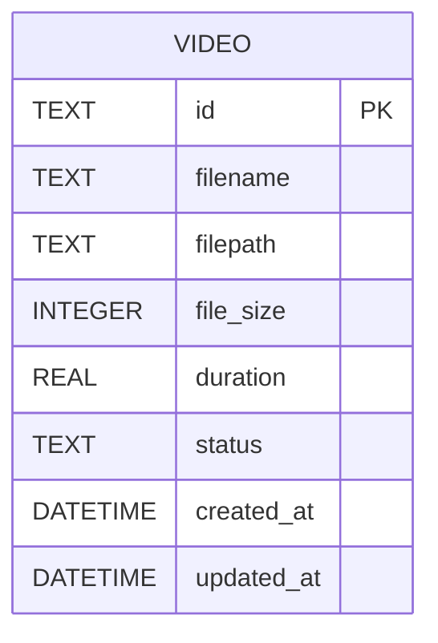

# REASONS Canvas: Video Library & Preview
Date: 2026-07-15
Analysis: analysis/2026-07-15-video-library-preview-analysis.md
Scope: full-stack

---

## R — Requirements

**Problem:** After a video is uploaded there is no way to see what is in the system. Users must remember IDs from the upload success screen. Every downstream editing feature (Stories 4–10) begins with the user selecting a video, but no selection UI exists yet.

**Goal:** Provide a Video Library page that lists all uploaded videos with metadata, allows in-page preview via an HTML5 player, and allows deletion — giving the user a single starting point for all future editing workflows.

**Definition of Done:**
- [ ] Given at least one video has been uploaded, when I navigate to `/library`, then I see a list of all uploaded videos with no missing entries.
- [ ] Given a video entry in the library, when I view its card, then I see the original filename, duration formatted as `mm:ss`, file size formatted in MB or GB (2 decimal places), and the upload timestamp.
- [ ] Given a video entry in the library, when I click the Preview button, then an HTML5 `<video>` player renders and I can play, pause, and seek the video without leaving the page.
- [ ] Given no videos have been uploaded, when I navigate to `/library`, then I see an empty-state message and a link that takes me to `/upload`.
- [ ] Given a video entry in the library, when I click Delete and confirm the action, then the video is removed from the list, the backend deletes the record and file, and I see the updated list (or empty state if it was the last video).
- [ ] Given the backend is unavailable, when I load `/library`, then I see an error message rather than a blank or crashed page.
- [ ] `GET /api/v1/videos` endpoint implemented, tested, and returning correct `List[VideoResponse]` schema.
- [ ] `GET /api/v1/videos/{id}/stream` endpoint implemented and returning video bytes with correct MIME type.
- [ ] No regression in existing upload, get-by-id, delete, or health endpoints.

---

## E — Entities

### Data Entities

No new tables or migrations. The existing `videos` table and `Video` model are unchanged — all required fields (`id`, `filename`, `file_size`, `duration`, `created_at`, `filepath`, `status`) are already present.

| Entity | Type | Key Fields | Relationships |
|--------|------|-----------|---------------|
| Video | Existing SQLAlchemy model | id, filename, filepath, file_size, duration, created_at, status | None in this story |

### Frontend Artifacts

| Name | Type | Path | Responsibility |
|------|------|------|----------------|
| `getVideos()` | API client function | `src/api/client.ts` | Calls `GET /api/v1/videos` and returns `Promise<Video[]>` |
| `getStreamUrl()` | API client function | `src/api/client.ts` | Returns the full stream URL for a given video id; used as the `<video src>` value |
| `LibraryPage` | React page | `src/pages/LibraryPage.tsx` | Fetches video list via `useQuery`; renders card grid, empty state, and error state |
| `VideoCard` | React component | `src/components/library/VideoCard.tsx` | Shows per-video metadata, toggleable HTML5 preview player, and two-step inline delete |
| `formatDuration` | Utility function | `src/components/library/VideoCard.tsx` (exported) | Converts float seconds to `mm:ss`; returns `"—"` for null |
| `formatSize` | Utility function | `src/components/library/VideoCard.tsx` (exported) | Converts bytes to `"X.XX MB"` or `"X.XX GB"` |

---

## A — Approach

**Pattern:** FastAPI `FileResponse` + service method (backend) · React Query `useQuery` + component-local state (frontend).

**Strategy:** The backend requires two additions: `VideoService.list_all()` (a single descending-order DB query) wired to `GET /api/v1/videos`, and a `GET /api/v1/videos/{id}/stream` route that reuses `VideoService.get_by_id()` then delegates file delivery to FastAPI's built-in `FileResponse`. `FileResponse` handles `Content-Range` and range-request headers automatically — the browser `<video>` element's seeking works without any extra streaming logic. The frontend is a single `useQuery` call in `LibraryPage` feeding a grid of `VideoCard` instances. `VideoCard` owns two pieces of local state: `previewOpen` (toggles the `<video>` element) and `confirmDelete` (two-step delete flow). `activePreviewId` is lifted to `LibraryPage` level so only one video plays at a time. After a delete, `queryClient.invalidateQueries` refreshes the list from the server — no local array manipulation.

**Scope In:**
- `GET /api/v1/videos` list endpoint returning newest-first
- `GET /api/v1/videos/{id}/stream` file-serving endpoint via `FileResponse`
- `VideoService.list_all(db)` static method
- MIME type resolver for `.mp4`, `.mov`, `.avi`, `.mkv`, `.webm`
- `getVideos()` and `getStreamUrl()` API client functions
- `LibraryPage` with card grid, skeleton loading, empty state, error state
- `VideoCard` with metadata, inline `<video>` preview toggle, two-step delete
- `formatDuration` and `formatSize` utility functions
- Library nav link in `Layout.tsx`
- `/library` route in `App.tsx`
- Backend tests for the list endpoint and stream endpoint

**Scope Out:**
- Thumbnail or poster-frame generation (FFmpeg seek — Story 3+)
- Sorting, filtering, or search
- Pagination or batch delete
- Renaming videos
- HLS or chunked streaming beyond what `FileResponse` provides natively
- Any editing operations (Stories 6–8)

---

## S — Structure

### API Structure

**Root:** `backend/app/`

**API Endpoints:**
- Method: GET — Path: `/api/v1/videos` — Auth: none — Returns: `List[VideoResponse]`
- Method: GET — Path: `/api/v1/videos/{id}/stream` — Auth: none — Returns: video file bytes with MIME type

**New Files:**
- None — all additions go into existing files

**Modified Files:**
- `backend/app/services/video.py` — add `VideoService.list_all(db)` static method
- `backend/app/api/v1/videos.py` — add `GET /` list route, add `GET /{id}/stream` route, add MIME mapping constant, import `FileResponse` from `fastapi.responses`

**Database:**
- No migrations — `Video` model and `videos` table are unchanged

### Frontend Structure

**Root:** `frontend/src/`

**New Files:**
- `frontend/src/pages/LibraryPage.tsx` — library page with query, grid, empty state, error state
- `frontend/src/components/library/VideoCard.tsx` — per-video card with preview and delete

**Modified Files:**
- `frontend/src/api/client.ts` — add `getVideos()` and `getStreamUrl()` exports
- `frontend/src/App.tsx` — add `/library` route
- `frontend/src/components/common/Layout.tsx` — add Library entry to `NAV_LINKS`

---

## O — Operations

1. [BE] Modify `backend/app/services/video.py` — add a static method `list_all(db: Session) -> List[Video]` that queries the Video table with descending order on `created_at` and returns all rows; no filtering, no pagination; import `List` from `typing`

2. [BE] Modify `backend/app/api/v1/videos.py` — add a module-level `MIME_TYPES` dict mapping each allowed extension string (`.mp4`, `.mov`, `.avi`, `.mkv`, `.webm`) to its MIME type string (`video/mp4`, `video/quicktime`, `video/x-msvideo`, `video/x-matroska`, `video/webm`); import `FileResponse` from `fastapi.responses` and `Path` from `pathlib`; add a `GET /` route that calls `VideoService.list_all(db)` and returns a list of `VideoResponse` objects validated from each ORM instance; add a `GET /{id}/stream` route that calls `VideoService.get_by_id(video_id, db)` to confirm the record exists (raises 404 if not), checks that `Path(video.filepath).exists()` and raises `HTTPException(404, "Video file not found on disk.")` if the file is missing, resolves the MIME type from the file extension using `MIME_TYPES` (defaulting to `video/mp4`), and returns `FileResponse(video.filepath, media_type=mime_type, content_disposition_type="inline")`

3. [BE] Modify `backend/tests/test_videos.py` — within the existing `TestVideoUpload` class add or verify coverage is not broken; add a `TestVideoList` class with methods: `test_list_empty_returns_200_with_empty_array` verifies `GET /api/v1/videos` returns 200 and a JSON array when no videos exist; `test_list_returns_all_uploaded_videos` uploads two videos then verifies the list contains both ids; `test_list_items_match_video_response_schema` verifies each item in the list has all required fields (id, filename, file_size, duration, status, created_at); `test_list_is_ordered_newest_first` uploads two videos and verifies the returned order; add a `TestVideoStream` class with methods: `test_stream_returns_200_for_known_video` uploads a video and verifies `GET /api/v1/videos/{id}/stream` returns 200 with a `video/` content-type header; `test_stream_returns_404_for_unknown_id` verifies a random UUID returns 404; all upload calls in these tests use the `_upload` helper with the mocked FFmpegService.probe

4. [FE] Modify `frontend/src/api/client.ts` — add `getVideos` as a named export that calls `api.get<Video[]>('/api/v1/videos')`; add `getStreamUrl` as a named export that accepts a `videoId: string` and returns the string `${BASE_URL}/api/v1/videos/${videoId}/stream`; export `BASE_URL` (or keep `getStreamUrl` as the only access point — do not export `BASE_URL` directly since `getStreamUrl` encapsulates the pattern)

5. [FE] Create `frontend/src/components/library/VideoCard.tsx` — a React functional component accepting `video: Video`, `isActive: boolean`, `onPreviewToggle: () => void`, and `onDeleted: () => void` props; exports two named utility functions: `formatDuration(seconds: number | null): string` that returns `"—"` for null and otherwise computes `Math.floor(seconds / 60)` padded minutes and `Math.floor(seconds % 60)` zero-padded seconds joined with a colon; `formatSize(bytes: number): string` that divides by `1024 * 1024 * 1024` if the result is at least 1 and returns `"X.XX GB"`, otherwise divides by `1024 * 1024` and returns `"X.XX MB"`; the card body renders the filename, formatted duration, formatted size, and upload date (`new Date(video.created_at).toLocaleDateString()`); a Preview toggle button calls `onPreviewToggle` and its label reads "Hide Preview" when `isActive` and "Preview" otherwise; when `isActive`, renders an HTML5 `<video controls className="w-full rounded mt-3">` element with `src` set to `getStreamUrl(video.id)`; a Delete button on first click sets local `confirmDelete` state to true; when `confirmDelete` is true shows a "Confirm?" button that on click calls `deleteVideo(video.id)` via a `useMutation` and on success calls `onDeleted()` and resets `confirmDelete`; the card's `onMouseLeave` resets `confirmDelete` to false

6. [FE] Create `frontend/src/pages/LibraryPage.tsx` — a React page component; holds `activePreviewId` state as `string | null` initialised to `null`; calls `useQuery({ queryKey: ['videos'], queryFn: getVideos })`; while `isLoading` renders a skeleton grid of four placeholder cards using `animate-pulse` following the `Dashboard.tsx` skeleton pattern; on `isError` renders an error banner with the error message following the `Dashboard.tsx` error pattern; when `data` is an empty array renders an empty-state `
` with a message and a `<Link to="/upload">` reading "Upload your first video"; when `data` has items renders a responsive grid (`grid-cols-1 sm:grid-cols-2 lg:grid-cols-3 gap-4`) of `VideoCard` instances each receiving `video`, `isActive={activePreviewId === video.id}`, `onPreviewToggle` that sets `activePreviewId` to `video.id` if not active or `null` if already active, and `onDeleted` that calls `queryClient.invalidateQueries({ queryKey: ['videos'] })`; uses `useQueryClient()` to get the client instance

7. [FE] Modify `frontend/src/App.tsx` — import `LibraryPage` from `@/pages/LibraryPage` and add `<Route path="/library" element={<LibraryPage />} />` alongside the existing Dashboard and Upload routes

8. [FE] Modify `frontend/src/components/common/Layout.tsx` — add `{ to: "/library", label: "Library" }` to the `NAV_LINKS` array between the Dashboard and Upload entries; no other changes to the component

---

## N — Norms

### API Norms

- FastAPI module path: `backend/app/` with sub-packages `core/`, `api/v1/`, `models/`, `schemas/`, `services/`, `workers/`
- All config values come from the pydantic `settings` singleton — never from `os.environ` directly
- Database sessions are obtained exclusively via the `get_db()` `Depends` — never instantiated inline
- All file paths use `pathlib.Path` — no string concatenation with slashes
- Logging uses the configured logger (`logging.getLogger(__name__)`) — no print statements
- Router files define only HTTP handlers — business logic lives in services
- New environment variables must be added to both `.env.example` and the `Settings` class in `config.py`
- Async file I/O uses `aiofiles` — never `open()` in an async context
- Long-running external tool calls (FFmpeg) must use `asyncio` subprocess, never `subprocess.run`
- `FileResponse` is the correct tool for serving files — do not read files into memory and return them as bytes

### Frontend Norms

- All API calls go through `src/api/client.ts` — no raw `fetch` or `XHR` calls in components
- Environment variables must be prefixed with `VITE_` to be accessible in the browser bundle
- Path imports use the `@/` alias — no relative `../../` chains
- Server state is managed with TanStack React Query — `useMutation` for writes, `useQuery` for reads
- All components are typed with explicit prop interfaces — no implicit `any`
- Components handle loading, empty, and error states explicitly — no silent failures
- Page components are placed in `src/pages/`, reusable UI in `src/components/`
- `queryClient.invalidateQueries` is the only correct way to refresh server state after a mutation — do not manually splice arrays

---

## S — Safeguards

### API Safeguards

- FFmpeg probe must run via `asyncio.create_subprocess_exec` — never `subprocess.run` or `subprocess.Popen` — to avoid blocking the event loop under concurrent requests
- Validate `Path(video.filepath).exists()` before calling `FileResponse` — a missing file must return 404, not a 500 from starlette trying to open a non-existent path
- The stream route must set `content_disposition_type="inline"` — not `"attachment"` — to enable in-browser playback via `<video>` rather than triggering a file download
- `HTTPException` must use the correct status code: 404 for unknown id or missing file, not 400 or 500
- `GET /api/v1/videos` must return an empty JSON array when no videos exist — not a 404 or null response; an empty list is a valid success state
- The list route must not break if individual rows have null `duration` values — `VideoResponse` already marks duration as `Optional[float]`, so this is safe; confirm no `NOT NULL` assumption is added

### Frontend Safeguards

- `queryClient.invalidateQueries({ queryKey: ['videos'] })` must be called in `onDeleted` — never rely on local array splicing; the server is the source of truth
- Clear the active preview (`setActivePreviewId(null)`) inside the `onDeleted` callback before the query invalidation, to prevent the `<video>` element from holding a reference to a URL that will 404 after deletion
- `formatDuration` must handle `null` gracefully — render `"—"` not throw or render `NaN:NaN`
- The `<video>` element must use `controls` — do not build a custom player; the browser native controls are sufficient and accessible for this story
- Error messages from the server must be surfaced in the UI — the delete mutation error must be shown on the card, not swallowed silently
- `confirmDelete` state must reset to false on `onMouseLeave` — prevents a stale "Confirm?" button from remaining visible after the user moves away

---

## Change Log

- 2026-07-15: Canvas created from analysis/2026-07-15-video-library-preview-analysis.md
