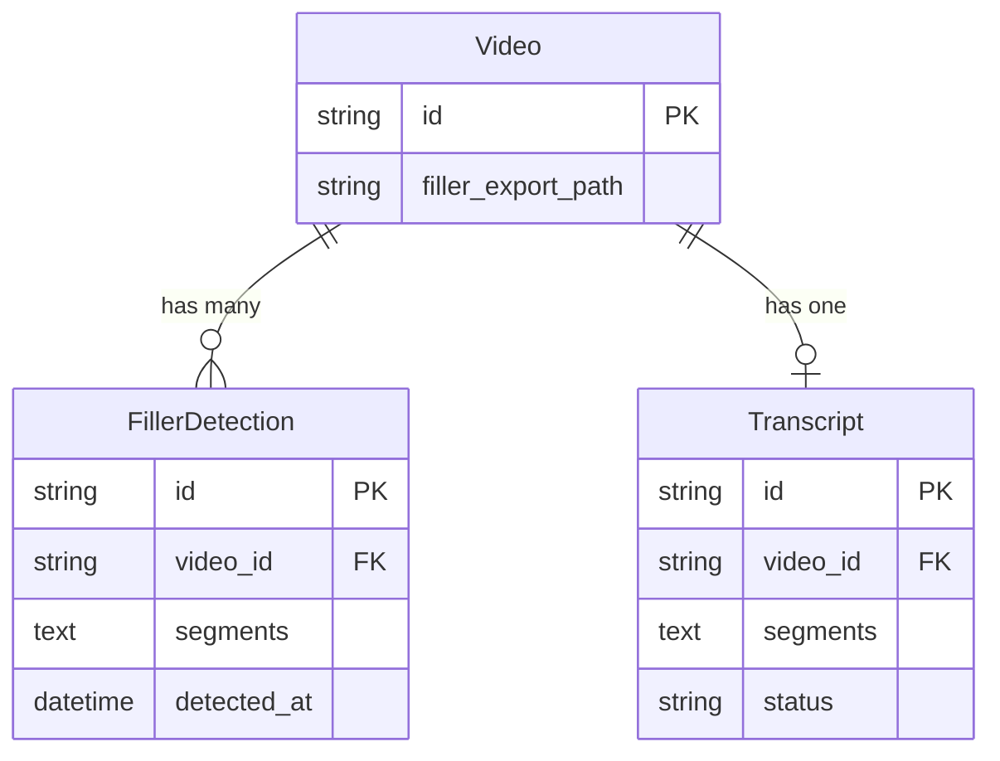

# REASONS Canvas: Filler Word Removal
Date: 2026-07-17
Analysis: 2026-07-17-filler-word-removal-analysis.md
Scope: full-stack

---

## R — Requirements

**Problem:** Videos recorded with spoken narration contain filler words ("um", "uh", "hmm", etc.) that reduce clarity and professionalism. There is currently no way to detect or remove them in the editor.

**Goal:** Allow users to detect filler words in a video's transcript, review their timestamps, remove the corresponding segments from the video, and preview the cleaned export — all within the existing video card UI.

**Definition of Done:**
- [ ] Given a video with a completed transcript, when the user clicks "Detect Fillers", then the system scans the transcript segments and returns a list of filler words with their start/end timestamps
- [ ] Given filler words have been detected, when the user views the video card, then a table showing word, start time, end time, and duration is displayed
- [ ] Given filler segments are displayed, when the user clicks "Remove Fillers", then the system cuts those segments from the original video, merges the remaining clips, saves the export, and updates the video record
- [ ] Given removal is complete, when the user views the panel, then the segment table clears, a green "Fillers removed" confirmation appears, a gray "Re-remove" button is available, and the processed video plays inline
- [ ] Given no transcript exists or transcript is not completed, when the user views the filler panel, then the detect button is disabled with a "Transcribe first" label
- [ ] Given a video has no filler words in its transcript, when detection completes, then a "No filler words detected" message is shown and no remove button appears
- [ ] Backend tests written and passing at greater than 96% quality score
- [ ] No regression in silence removal, transcription, or subtitle flows

---

## E — Entities

### Data Entities

| Entity | Type | Key Fields | Relationships |
|--------|------|-----------|---------------|
| FillerDetection | New ORM model | id, video_id, segments (JSON TEXT), detected_at | belongs to Video via video_id (CASCADE delete) |
| Video | Existing — modified | adds filler_export_path (nullable TEXT) | owns many FillerDetection records |
| Transcript | Existing — read only | video_id, segments (JSON TEXT), status | source of filler timestamps — not modified |

### Frontend Artifacts

| Name | Type | Path | Responsibility |
|------|------|------|----------------|
| FillerPanel.tsx | New React component | frontend/src/components/library/ | Renders detect button, filler segment table with word column, remove button, and export preview |
| VideoCard.tsx | Modified component | frontend/src/components/library/ | Add fillerDetection state, fillerError state, detectMutation, removeMutation, on-mount getFillers fetch, FillerPanel render |
| types/index.ts | Modified TypeScript file | frontend/src/types/ | Add FillerSegment interface, FillerDetection interface, filler_export_path field on Video |
| api/client.ts | Modified TypeScript file | frontend/src/api/ | Add detectFillers, getFillers, removeFillers, getFillerExportStreamUrl functions |

---

## A — Approach

**Pattern:** FastAPI Service class + SQLAlchemy ORM model + React component with TanStack Query mutations

**Strategy:** Filler detection is pure text processing — the Whisper transcript segments already contain text and timestamps, so no FFmpeg audio analysis is needed. The FillerService scans each completed transcript segment's text against a hardcoded filler word set, and returns matching segments with their existing timestamps. Removal inverts the filler ranges to find non-filler windows, then uses the existing FFmpegService.concat_segments pipeline (identical to silence removal) to cut and merge clips. The frontend FillerPanel mirrors SilencePanel with one addition: a word column in the segment table.

**Scope In:**
- Detecting filler words by scanning completed Whisper transcript segments against a fixed English word set
- Returning detected segments with word, start, end, and duration fields
- Removing filler segments from the original video using FFmpeg cut and concat
- Saving the export to a new filler_export_path column on the Video record
- Displaying detected fillers in a panel with word + timestamps
- Inline export preview after removal
- Disabled detect button with "Transcribe first" label when no completed transcript exists

**Scope Out:**
- Custom or user-defined filler word lists
- Language support beyond English
- Word-level timestamp detection (requires faster-whisper word_timestamps=True, deferred to future story)
- Per-filler approval before removal (bulk remove only)
- Adjustable cut style (crossfade vs hard cut)
- Detecting fillers without an existing transcript

---

## S — Structure

### API Structure

**New Files:**
- `backend/app/models/filler.py` — FillerDetection ORM model, mirrors silence.py structure
- `backend/app/schemas/filler.py` — FillerSegment and FillerDetectionResponse Pydantic schemas with JSON field_validator
- `backend/app/services/filler.py` — FillerService with detect(), get_segments(), and remove() methods; hardcoded FILLER_WORDS set at module level
- `backend/app/api/v1/fillers.py` — API router with 4 endpoints and module-level _in_flight set
- `backend/tests/test_fillers.py` — test suite covering FillerService unit tests and all 4 endpoints

**Modified Files:**
- `backend/app/models/video.py` — add filler_export_path nullable Text column
- `backend/app/models/__init__.py` — import FillerDetection to register with Base.metadata
- `backend/app/schemas/video.py` — add filler_export_path Optional[str] to VideoResponse
- `backend/app/main.py` — add _migrate_filler_columns() startup function and register fillers router

**API Endpoints:**
- POST `/api/v1/videos/{video_id}/fillers/detect` — run detection against transcript, upsert FillerDetection record
- GET `/api/v1/videos/{video_id}/fillers` — retrieve stored FillerDetection record
- POST `/api/v1/videos/{video_id}/fillers/remove` — cut filler segments from original video, update filler_export_path
- GET `/api/v1/videos/{video_id}/fillers/export/stream` — stream the filler-removed export file inline

### Frontend Structure

**New Files:**
- `frontend/src/components/library/FillerPanel.tsx` — panel component accepting fillerDetection, transcript, onDetect, onRemove, isDetecting, isRemoving, exportStreamUrl props

**Modified Files:**
- `frontend/src/types/index.ts` — add FillerSegment interface, FillerDetection interface, filler_export_path on Video
- `frontend/src/api/client.ts` — add detectFillers, getFillers, removeFillers, getFillerExportStreamUrl
- `frontend/src/components/library/VideoCard.tsx` — add fillerDetection state, fillerError state, detect and remove mutations, on-mount getFillers fetch, FillerPanel render below SilencePanel

---

## O — Operations

1. [BE] Add filler_export_path nullable Text column to the Video ORM model in app/models/video.py and add filler_export_path Optional[str] to VideoResponse in app/schemas/video.py
2. [BE] Create app/models/filler.py — FillerDetection ORM model with id, video_id (CASCADE FK to videos), segments (nullable Text), detected_at; import it in app/models/__init__.py
3. [BE] Create app/schemas/filler.py — FillerSegment Pydantic model (word str, start float, end float, duration float) and FillerDetectionResponse (id, video_id, segments list, detected_at) with field_validator to decode JSON segments string
4. [BE] Create app/services/filler.py — FillerService class with: module-level FILLER_WORDS frozen set; detect() method that queries completed transcript, scans segments text against FILLER_WORDS (strip punctuation, lowercase), upserts FillerDetection record; get_segments() method that returns stored record or raises 404; remove() method that fetches detection record, inverts filler ranges to compute non-filler windows, extracts clips from original video.filepath using ffmpeg -ss/-to -c copy to temp files, calls FFmpegService.concat_segments(), saves to exports_path, updates video.filler_export_path
5. [BE] Create app/api/v1/fillers.py — module-level _in_flight set; POST detect endpoint calling FillerService.detect(); GET endpoint calling FillerService.get_segments(); POST remove endpoint with 409 in-flight guard calling FillerService.remove(); GET export/stream endpoint reading video.filler_export_path and returning FileResponse inline
6. [BE] Update app/main.py — add _migrate_filler_columns() function that runs idempotent ALTER TABLE videos ADD COLUMN filler_export_path TEXT; call it in the lifespan startup sequence after _migrate_silence_columns(); import and register fillers router with prefix /api/v1/videos and tag fillers
7. [FE] Update frontend/src/types/index.ts — add FillerSegment interface with word, start, end, duration fields; add FillerDetection interface with id, video_id, segments, detected_at; add filler_export_path nullable string field to the existing Video interface
8. [FE] Update frontend/src/api/client.ts — add detectFillers(videoId) POST function returning FillerDetection; add getFillers(videoId) GET function returning FillerDetection; add removeFillers(videoId) POST function returning export_url object; add getFillerExportStreamUrl(videoId) function returning the stream URL string
9. [FE] Create frontend/src/components/library/FillerPanel.tsx — renders: header with "Filler Words" label and detect button (disabled with "Transcribe first" label when transcript is null, otherwise "Detect Fillers" / "Re-detect"); when fillerDetection has segments, a scrollable table with columns word, start, end, duration and a red "Remove Fillers" button; when segments is empty and exportStreamUrl exists, green "Fillers removed" text and gray "Re-remove" button; when segments is empty and no exportStreamUrl, "No filler words detected" italic text; export video preview when exportStreamUrl is non-null
10. [FE] Update frontend/src/components/library/VideoCard.tsx — add fillerDetection state (FillerDetection or null), fillerError state; add detectMutation calling detectFillers and on success calling getFillers to update state; add removeMutation calling removeFillers and on success clearing segments from fillerDetection state and invalidating videos query; add useEffect that fetches getFillers on mount when video status is ready; render FillerPanel below SilencePanel passing transcript prop; include fillerError in the error display block
11. [BE] Create backend/tests/test_fillers.py — TestFillerService class with unit tests for the text-scanning logic (typical filler match, no fillers, mixed segment, punctuation stripping, empty transcript); TestFillerDetect class (happy path returns segments, stores to DB, 400 when no transcript, 400 when transcript not completed, 404 unknown video, overwrites previous record, empty filler list); TestFillerGet class (stored detection, 404 never detected with detail assertion, 404 unknown video with detail assertion, stored detection with empty segments); TestFillerRemove class (400 no detection, 400 all fillers, 404 unknown video with detail assertion, happy path mocked service, 409 in-flight)

---

## N — Norms

### API Norms

- Follow the established FastAPI pattern: ORM model → Pydantic schema → Service class → API router → tests
- Python 3.9 compatibility: use Optional[X] and List[X] from typing, not X | None or list[X]
- Pydantic v2: use ConfigDict(from_attributes=True) and @field_validator with @classmethod
- SQLAlchemy 2.0: use Mapped[Optional[str]] for nullable columns
- All FFmpeg subprocess calls must run via asyncio.to_thread — never block the event loop
- Use try/finally to guarantee temp segment file cleanup even on FFmpeg failure
- Log all state changes with logger.info including video_id and result counts
- Service methods raise HTTPException directly — routers do not add extra error handling
- No hardcoded file paths — always use settings.exports_path and settings.temp_path

### Frontend Norms

- Follow existing component pattern: VideoCard owns state, panels receive props and callbacks only
- Use TanStack Query useMutation for all API mutations — never call API functions directly in event handlers
- TypeScript strict — no implicit any, all props typed via interfaces
- Tailwind CSS only — no inline styles
- Format timestamps using the same formatSeconds helper pattern as SilencePanel
- Error state must be surfaced to the user — never swallow API errors silently
- Loading states must disable interactive buttons with disabled:opacity-50

---

## S — Safeguards

### API Safeguards

- Never modify the Transcript record — FillerService reads it read-only
- Never overwrite Video.export_path — filler removal writes only to Video.filler_export_path
- The _migrate_filler_columns() function must use try/except OperationalError to be idempotent — never run raw ALTER TABLE without this guard
- All four filler endpoints must be registered before running tests — include router in main.py
- The _in_flight set must use discard (not remove) in the finally block to prevent KeyError
- Temp segment files must be deleted in a finally block even if FFmpeg fails partway through
- The detect endpoint must check transcript.status == completed before scanning — return 400 if missing or not completed
- Do not add the "like" and "so" false-positive risk to a blocking safeguard — it is accepted scope for V1

### Frontend Safeguards

- FillerPanel must handle all four states: loading (button disabled), segments present (table + remove button), removed (green message + gray re-remove), no fillers (italic message)
- The detect button must be rendered as disabled (not hidden) when transcript is null — do not hide the feature from users who have not transcribed yet
- The removeMutation onSuccess must clear segments from local state by setting fillerDetection to prev with empty segments array — do not re-fetch the DB record which still holds the old detection
- Both fillerError and silenceError must appear in the same error display block in VideoCard — do not add a separate error section
- getFillerExportStreamUrl must return a string (not a Promise) — same pattern as getExportStreamUrl for silence

---

## Change Log

Canvas generated 2026-07-17 from analysis 2026-07-17-filler-word-removal-analysis.md
