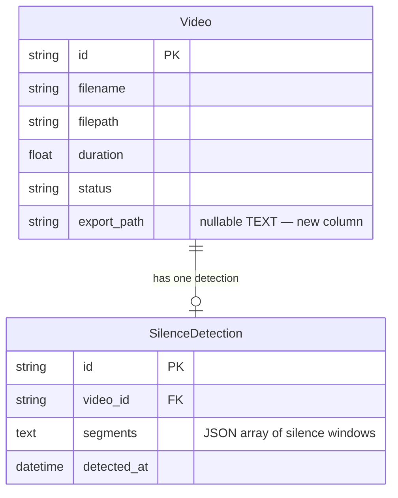

# REASONS Canvas: Silence Detection & Removal
Date: 2026-07-17
Analysis: 2026-07-17-silence-detection-removal-analysis.md
Scope: full-stack

---

## R — Requirements

**Problem:** The app has no way to shorten videos by removing dead air. Users must manually identify and cut silent sections in external tools, which defeats the purpose of an AI-powered editor.

**Goal:** Allow a video creator to detect silent segments in one click, review the list, then remove them and preview the resulting shorter video — all within the app.

**Definition of Done:**
- [ ] Given a ready video, when the user triggers silence detection, then the backend runs FFmpeg silencedetect and returns a list of segments with start, end, and duration fields
- [ ] Given detection returns results, when the frontend renders them, then each silent segment is displayed as a row with its start time, end time, and duration in seconds
- [ ] Given detection returns zero segments, when the UI renders, then a "No silence detected" message is shown (not an empty list with no explanation)
- [ ] Given detection is triggered on an unknown video ID, when the request hits the API, then a 404 is returned
- [ ] Given a video that was previously scanned, when detection is triggered again, then the previous result is replaced with the new one
- [ ] Given a video has stored silence segments, when the user triggers removal, then FFmpeg cuts the non-silent parts and concatenates them into a new file in the exports directory
- [ ] Given removal completes, when the frontend receives the export URL, then it renders an inline video preview player for the processed file
- [ ] Given a video has no stored silence segments, when removal is triggered, then a 400 is returned with a clear error message
- [ ] Given a removal job is already in progress for a video, when a duplicate removal request arrives, then a 409 is returned
- [ ] Given removal completes, when the export is previewed, then the video plays inline without prompting a file download

---

## E — Entities

### Data Entities

| Entity | Type | Key Fields | Relationships |
|--------|------|-----------|---------------|
| Video | Existing model | id, filename, filepath, duration, status, export_path (new nullable TEXT) | has one SilenceDetection |
| SilenceDetection | New model | id (UUID PK), video_id (FK → videos CASCADE), segments (JSON TEXT), detected_at (DateTime) | belongs to Video |

### Frontend Artifacts

| Name | Type | Path | Responsibility |
|------|------|------|----------------|
| SilencePanel.tsx | New React component | `frontend/src/components/library/` | Renders detect button, segment list, remove button, export preview player |
| VideoCard.tsx | Existing component (extend) | `frontend/src/components/library/` | Gains silence state, detectMutation, removeMutation, SilencePanel rendering |
| types/index.ts | Existing type file (extend) | `frontend/src/types/` | Add SilenceSegment and SilenceDetection interfaces; add export_path to Video |
| api/client.ts | Existing API client (extend) | `frontend/src/api/` | Add detectSilence, getSilence, removeSilence, getExportStreamUrl exports |

---

## A — Approach

**Pattern:** FFmpegService extension + SilenceService orchestration + dedicated APIRouter, mirroring the existing SubtitleService and subtitles router pattern; frontend follows the TranscriptPanel + VideoCard composition model.

**Strategy:** Extend FFmpegService with two new async static methods that run FFmpeg via asyncio.to_thread — one for silencedetect (parsing stderr output with regex) and one for concat demuxer assembly. SilenceService owns the business logic: computing non-silent windows by inverting the silence ranges against video duration, managing temp segment files with a try/finally cleanup guarantee, and upserting the SilenceDetection record. The silence router re-uses VideoService.get_by_id() for 404 guards and the established module-level _in_flight set for 409 protection on the removal endpoint.

**Scope In:**
- FFmpeg silencedetect with fixed threshold of negative 50 dB noise floor and 0.5 second minimum silence duration
- Parse stderr output to extract silence start, end, and duration for each window
- Store detected segments as JSON in a SilenceDetection record; upsert on re-detect (delete old, insert new)
- Removal: extract non-silent clips to temp directory, concatenate with FFmpeg concat demuxer using stream copy, write output to exports directory
- Store export path on the Video record; return a streamable URL
- Frontend: detect button, scrollable segment list with formatted timestamps, remove button, inline export preview player

**Scope Out:**
- Configurable silence threshold or minimum duration (always use fixed defaults)
- Selective segment exclusion before removal (all-or-nothing)
- Real-time removal progress via WebSocket
- Waveform or audio visualisation
- Filler word detection (Story 7)

---

## S — Structure

### API Structure

**New Files:**
- `backend/app/models/silence.py` — SilenceDetection ORM model and silence_detections table
- `backend/app/schemas/silence.py` — SilenceSegment and SilenceDetectionResponse Pydantic v2 schemas
- `backend/app/services/silence.py` — SilenceService orchestration class
- `backend/app/api/v1/silence.py` — APIRouter with three endpoints and _in_flight set
- `backend/tests/test_silence.py` — full test suite for silence feature

**Modified Files:**
- `backend/app/models/video.py` — add export_path nullable TEXT mapped column
- `backend/app/models/__init__.py` — re-export SilenceDetection so Base.metadata registers the new table
- `backend/app/schemas/video.py` — add Optional export_path field to VideoResponse
- `backend/app/services/ffmpeg.py` — add detect_silence() and concat_segments() static async methods
- `backend/app/main.py` — add _migrate_silence_columns() startup function; register silence router

**API Endpoints:**
- POST `/api/v1/videos/{video_id}/silence/detect` — run silencedetect, upsert SilenceDetection, return SilenceDetectionResponse
- GET `/api/v1/videos/{video_id}/silence` — return stored SilenceDetectionResponse (404 if never detected)
- POST `/api/v1/videos/{video_id}/silence/remove` — run FFmpeg cut+concat, persist export_path on Video, return export_url

**Database:**
- New table: `silence_detections` — created by SQLAlchemy create_all on first startup (no ALTER TABLE needed for a new table)
- Existing table: `videos` — add `export_path TEXT NULL` via idempotent ALTER TABLE guard in _migrate_silence_columns()

### Frontend Structure

**New Files:**
- `frontend/src/components/library/SilencePanel.tsx` — silence detection and removal UI panel

**Modified Files:**
- `frontend/src/types/index.ts` — add SilenceSegment interface, SilenceDetection interface, export_path on Video
- `frontend/src/api/client.ts` — add detectSilence, getSilence, removeSilence, getExportStreamUrl
- `frontend/src/components/library/VideoCard.tsx` — add silence state, two mutations, SilencePanel rendering, on-mount getSilence fetch

---

## O — Operations

1. [BE] Extend `backend/app/models/video.py` — add `export_path` as a nullable TEXT Mapped column using Optional[str]; this is an existing table so the column is added at the ORM level here and at the DB level by the startup migration in Operation 7
2. [BE] Create `backend/app/models/silence.py` — define the SilenceDetection ORM model with id (UUID PK, default uuid4), video_id (TEXT, FK to videos with CASCADE delete), segments (TEXT nullable, stores JSON), and detected_at (DateTime, default utcnow); update `backend/app/models/__init__.py` to import and re-export SilenceDetection alongside Video and Transcript so Base.metadata includes the new table in create_all
3. [BE] Create `backend/app/schemas/silence.py` — define SilenceSegment Pydantic model with start, end, duration as floats; define SilenceDetectionResponse with id, video_id, segments as List[SilenceSegment], and detected_at, with ConfigDict from_attributes=True and a field_validator on segments that JSON-decodes the TEXT column into a list; also add Optional[str] export_path field to VideoResponse in `backend/app/schemas/video.py`
4. [BE] Extend `backend/app/services/ffmpeg.py` — add static async method detect_silence(filepath, noise_db=-50, min_duration=0.5) that runs the FFmpeg silencedetect audio filter in null output mode via asyncio.to_thread, reads stderr, uses regex to match silence_end and silence_duration values, computes silence_start as end minus duration, and returns a list of dicts with start/end/duration keys; add static async method concat_segments(segment_paths, output_path) that writes an FFmpeg concat list file to a temp location using POSIX-formatted paths, runs ffmpeg with concat demuxer and stream copy flag via asyncio.to_thread, and raises ValueError on non-zero exit code
5. [BE] Create `backend/app/services/silence.py` — SilenceService with: detect(video_id, filepath, db) class method calling FFmpegService.detect_silence, deleting any existing SilenceDetection for the video, inserting a new record, committing, and returning SilenceDetectionResponse; get_segments(video_id, db) class method querying the record and raising 404 HTTPException if absent; compute_non_silent_windows(video_duration, silence_segments) static method that inverts silence ranges against (0, video_duration) to produce a list of (start, end) float tuples for non-silent portions; remove(video_id, db) class method fetching the SilenceDetection record (400 if missing), calling compute_non_silent_windows (400 if result is empty), extracting each non-silent window to temp_path as a numbered clip via FFmpeg, calling concat_segments, writing the result to exports_path, updating video.export_path and committing, cleaning up temp clips in finally, and returning the export stream URL string
6. [BE] Create `backend/app/api/v1/silence.py` — module-level _in_flight set; APIRouter; POST /{video_id}/silence/detect endpoint calling VideoService.get_by_id then SilenceService.detect, returning 200 with SilenceDetectionResponse; GET /{video_id}/silence endpoint calling SilenceService.get_segments, returning SilenceDetectionResponse; POST /{video_id}/silence/remove endpoint checking _in_flight for 409, adding to set, calling SilenceService.remove via asyncio.to_thread, removing from set in finally, returning JSONResponse with export_url
7. [BE] Modify `backend/app/main.py` — add _migrate_silence_columns() function running ALTER TABLE videos ADD COLUMN export_path TEXT in try/except OperationalError; import silence router; call _migrate_silence_columns() in lifespan after existing migration calls; register silence.router with prefix /api/v1/videos and tag silence
8. [FE] Extend `frontend/src/types/index.ts` — add SilenceSegment interface with start, end, duration as number fields; add SilenceDetection interface with id, video_id, segments as SilenceSegment array, and detected_at as string; add export_path: string | null field to the existing Video interface
9. [FE] Extend `frontend/src/api/client.ts` — add detectSilence(videoId) calling api.post returning SilenceDetection; add getSilence(videoId) calling api.get returning SilenceDetection; add removeSilence(videoId) calling api.post returning object with export_url string; add getExportStreamUrl(videoId) returning the full BASE_URL-prefixed stream path string
10. [FE] Create `frontend/src/components/library/SilencePanel.tsx` — props interface: silenceDetection (SilenceDetection or null), onDetect and onRemove callbacks, isDetecting and isRemoving booleans, exportStreamUrl (string or null); renders an amber "Detect Silence" button when silenceDetection is null; when detection exists, renders a heading showing segment count, a scrollable list where each row shows start time, end time, and duration formatted as seconds with two decimals, and a "No silence detected" message in place of the list when segments is empty; renders a red "Remove Silence" button disabled while isRemoving and only when segments are non-empty; when exportStreamUrl is non-null, renders a "Processed Preview" heading followed by a video element with controls and the stream URL as src
11. [FE] Extend `frontend/src/components/library/VideoCard.tsx` — add silenceDetection state (SilenceDetection or null, initially null); add silenceError state; add detectMutation using detectSilence, on success call getSilence(video.id).then(setSilenceDetection), on error set silenceError; add removeMutation using removeSilence, on success call getSilence(video.id).then(setSilenceDetection) and invalidateQueries videos, on error set silenceError; add useEffect that calls getSilence(video.id) when video.status is ready and silenceDetection is null, silently ignoring 404; render SilencePanel below TranscriptPanel with all props wired; display silenceError alongside existing error messages
12. [BE] Create `backend/tests/test_silence.py` — TestSilenceService class testing compute_non_silent_windows directly: typical case with two silence windows returns three non-silent windows, all-silence input returns empty list, no-silence input returns full video as one window, adjacent silence windows are handled correctly; TestSilenceDetect class testing POST detect happy path returns 200 with segments list, segments are stored in DB, 404 for unknown video, re-detect overwrites previous record and returns fresh segments, empty segments list returns 200 with empty array; TestSilenceGet class testing GET returns stored detection, 404 when detection never run; TestSilenceRemove class testing 400 when no detection stored, 409 when _in_flight mock active

---

## N — Norms

### API Norms

- FastAPI project structure: `backend/app/` — models, schemas, services, api/v1, core
- Services are static-method classes; routers call services directly — no repository layer
- All FFmpeg subprocess calls run via asyncio.to_thread — never blocking subprocess.run on the event loop
- Python 3.9 compatibility: use Optional[X] not X | None; use List[X] not list[X] in type hints
- Pydantic v2: use model_config = ConfigDict(from_attributes=True) for ORM mode; use @field_validator for custom decoding
- SQLAlchemy 2.0 Mapped columns: use Mapped[Optional[str]] for nullable text columns
- New tables are registered via SQLAlchemy Base.metadata and created by create_all() on startup — no separate migration file needed
- Existing-table column additions require idempotent ALTER TABLE guards (try/except OperationalError) in a startup migration function
- Log state changes with logger.info; log exceptions with logger.exception
- HTTP errors: HTTPException(status_code=404) for not found; 400 for bad state; 409 for conflict

### Frontend Norms

- React 18 with TypeScript; all components as named function exports
- TanStack Query useMutation for all write operations; child components receive callbacks as props and do not own mutations
- Call the relevant getter directly in onSuccess to update local state — do not rely on invalidateQueries alone for local component state
- Tailwind CSS only — no inline styles
- All API calls go through functions in api/client.ts — no direct fetch in components
- Errors displayed as inline p elements with text-xs text-red-400 class
- Buttons disabled with the disabled HTML attribute and styled with disabled:opacity-50

---

## S — Safeguards

### API Safeguards

- Never call FFmpeg synchronously on the event loop — always use asyncio.to_thread
- Always clean up temp segment files in a try/finally block — never leave orphaned files in temp_path on FFmpeg failure
- Never write to exports directory without first verifying non-silent windows exist — return 400 if the list is empty
- Never break existing video, transcription, or subtitle endpoints — the silence router is additive only
- All three silence endpoints must be covered by tests in test_silence.py
- Use POSIX paths (as_posix()) in all FFmpeg concat list files — Windows backslashes break the concat demuxer
- The _in_flight set must always be cleared in a finally block — a stuck removal must never permanently block retries

### Frontend Safeguards

- SilencePanel must handle all three detection states explicitly: not yet detected, detected with segments, detected with empty segments — never render a blank panel
- The remove button must be disabled while isRemoving is true — prevent double-submit
- The export preview player must use the stream URL from getExportStreamUrl — raw file paths must never be exposed in the UI
- getSilence() 404 on mount must be silently ignored — absence of a detection record is not an error condition
- silenceError must be displayed for both detect and remove failures — errors must never be swallowed silently

---

## Change Log

Initial canvas generated 2026-07-17.
