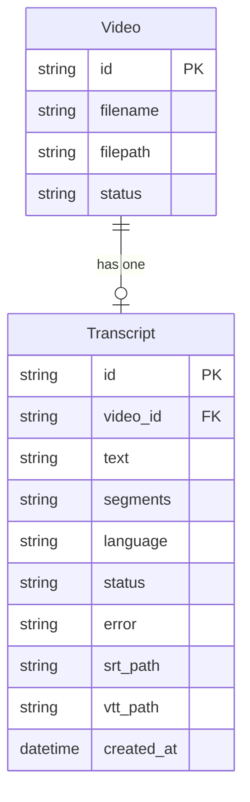

# REASONS Canvas: Subtitle Generation
Date: 2026-07-17
Analysis: 2026-07-17-subtitle-generation-analysis.md
Scope: full-stack

---

## R — Requirements

**Problem:** Videos that have been transcribed have no way to export the transcript as subtitle files, and the video player shows no subtitle track. Creators cannot verify timing, download subtitles, or enable captions during playback.

**Goal:** Generate SRT and VTT subtitle files from a completed transcript, serve them for browser download and for synchronized in-player preview via the HTML5 track element.

**Definition of Done:**
- [ ] Given a video with a completed transcript, when POST subtitles/generate is called, then the server returns 200 with SRT and VTT endpoint URLs and both files exist in storage/subtitles/
- [ ] Given a video with no completed transcript, when POST subtitles/generate is called, then the server returns 400 with a descriptive message
- [ ] Given subtitles have already been generated, when POST subtitles/generate is called again, then the server returns 409 Conflict
- [ ] Given subtitle files exist, when GET subtitles/srt is called, then the response has Content-Type text/plain with Content-Disposition attachment and a valid SRT body using sequential indices and HH:MM:SS,mmm timestamp format
- [ ] Given subtitle files exist, when GET subtitles/vtt is called, then the response has Content-Type text/vtt and the body starts with the WEBVTT header using HH:MM:SS.mmm timestamp format
- [ ] Given a transcript with three segments, when SRT is generated, then the output matches exact SRT format with 1-based sequential indices and comma as the millisecond separator
- [ ] Given subtitle generation completes, when the transcripts record is queried, then srt_path and vtt_path are non-null strings
- [ ] Given no subtitle files exist, when GET subtitles/srt or GET subtitles/vtt is called, then the server returns 404
- [ ] Given the TranscriptPanel with a completed transcript and no subtitles yet, when the user clicks Generate Subtitles, then the button enters loading state, the POST is called, and on success the Download SRT and Download VTT links appear
- [ ] Given subtitle files exist, when the user clicks a download link, then the browser triggers a file save with the correct extension
- [ ] Given a video with generated subtitles, when the video player renders, then a track element of kind subtitles is present pointing at the VTT endpoint
- [ ] Given the video player renders with a subtitle track, when the user clicks the CC toggle, then the subtitle track mode switches between showing and hidden
- [ ] Given a video with no subtitle files, when the video player renders, then no track element is present and no CC button is shown
- [ ] All 64 existing tests continue to pass with no regression

---

## E — Entities

### Data Entities

| Entity | Type | Key Fields | Relationships |
|--------|------|------------|---------------|
| Transcript | Existing model — modified | id, video_id (FK), text, segments, language, status, error, srt_path (new), vtt_path (new), created_at | belongs to Video via video_id |
| Video | Existing model — referenced only | id, filename, filepath, status | has one Transcript |

### Frontend Artifacts

| Name | Type | Path | Responsibility |
|------|------|------|----------------|
| TranscriptPanel | Existing component — modified | src/components/library/TranscriptPanel.tsx | Displays transcript text and segments; gains Generate Subtitles button and Download SRT/VTT anchor links |
| VideoCard | Existing component — modified | src/components/library/VideoCard.tsx | Owns all card mutations; gains subtitleMutation, videoRef, track element, and CC toggle button |
| client.ts | Existing API module — modified | src/api/client.ts | Gains generateSubtitles, getSubtitleSrtUrl, getSubtitleVttUrl exports |
| types/index.ts | Existing type file — modified | src/types/index.ts | Transcript interface gains srt_path and vtt_path fields |

---

## A — Approach

**Pattern:** Synchronous FastAPI service class for format conversion (BE) with prop-driven mutation pattern in VideoCard and expanded TranscriptPanel props (FE).

**Strategy:** SubtitleService is a pure conversion layer with no I/O — it accepts a decoded segment list and returns a formatted string. The generate endpoint calls the service, writes two small text files to storage/subtitles/, and updates both DB columns in a single commit. The subtitle paths live on TranscriptResponse (not VideoResponse) to avoid a join in the video list query — VideoCard already holds transcript in local state from Story 4. On the frontend, mutation ownership stays in VideoCard; the success handler calls getTranscript again directly to refresh srt_path and vtt_path in local state without a full list re-fetch. Download links are plain anchor elements — no fetch required. The CC toggle drives the browser's native TextTrack API via a videoRef.

**Scope In:**
- POST /api/v1/videos/{id}/subtitles/generate — synchronous generation, files written to storage/subtitles/
- GET /api/v1/videos/{id}/subtitles/srt — file download with attachment disposition
- GET /api/v1/videos/{id}/subtitles/vtt — file served with text/vtt MIME type
- srt_path and vtt_path nullable Text columns added to transcripts table
- SubtitleService.to_srt() and to_vtt() with correct format per-spec
- SQLite ALTER TABLE migration guard run on startup (idempotent)
- Settings.subtitles_path property and storage/subtitles/ dir creation in lifespan
- Frontend subtitle controls in TranscriptPanel (generate button, download anchors)
- track element and CC toggle in VideoCard

**Scope Out:**
- Adding srt_path/vtt_path to VideoResponse — kept on TranscriptResponse only to avoid a join
- Subtitle editing UI (adjusting text or timestamps in-browser)
- Burning subtitles into the exported video via FFmpeg (Story 8)
- Multiple language subtitle tracks
- ASS/SSA or other subtitle formats
- VTT cue styling via the WEBVTT ::cue directive
- Word-level timestamp granularity

---

## S — Structure

### API Structure

**Module:** `backend/app/`

**API Endpoints:**
- POST /api/v1/videos/{video_id}/subtitles/generate — returns 200 with srt_url and vtt_url
- GET /api/v1/videos/{video_id}/subtitles/srt — returns SRT file download
- GET /api/v1/videos/{video_id}/subtitles/vtt — returns VTT content with text/vtt MIME

**New Files:**
- `backend/app/services/subtitle.py` — SubtitleService with to_srt(), to_vtt(), and private _format_ts() helper
- `backend/app/api/v1/subtitles.py` — APIRouter with the three subtitle endpoints
- `backend/tests/test_subtitles.py` — test suite for SubtitleService unit tests and endpoint integration tests

**Modified Files:**
- `backend/app/models/transcript.py` — add srt_path and vtt_path nullable Mapped columns
- `backend/app/schemas/transcript.py` — add srt_path and vtt_path Optional fields to TranscriptResponse
- `backend/app/core/config.py` — add subtitles_path property following the existing storage path pattern
- `backend/app/main.py` — import and register subtitles router; add subtitles_path.mkdir() in lifespan; add ALTER TABLE migration guard after init_db()

**Database:**
- Two nullable TEXT columns added to the transcripts table: srt_path and vtt_path
- Managed via a startup idempotent guard using ALTER TABLE with try/except OperationalError (project has no Alembic migration system)

### Frontend Structure

**Module directory:** `frontend/src/`

**New Files:** None

**Modified Files:**
- `frontend/src/types/index.ts` — add srt_path and vtt_path to Transcript interface
- `frontend/src/api/client.ts` — add generateSubtitles, getSubtitleSrtUrl, getSubtitleVttUrl
- `frontend/src/components/library/TranscriptPanel.tsx` — add props and subtitle control UI
- `frontend/src/components/library/VideoCard.tsx` — add subtitleMutation, videoRef, track element, CC toggle

---

## O — Operations

1. [BE] Add subtitles_path property to Settings in app/core/config.py — returns self.storage_path / "subtitles", following the same @property pattern as uploads_path, exports_path, and temp_path

2. [BE] Update the lifespan function in app/main.py with two additions: add settings.subtitles_path.mkdir(parents=True, exist_ok=True) alongside the existing storage dir creations; add a startup ALTER TABLE migration guard function that runs ALTER TABLE transcripts ADD COLUMN srt_path TEXT and ALTER TABLE transcripts ADD COLUMN vtt_path TEXT, each wrapped independently in try/except OperationalError so the guard is safe to run on every startup regardless of whether the columns already exist — call it after init_db()

3. [BE] Add srt_path and vtt_path columns to Transcript in app/models/transcript.py — both are Mapped[Optional[str]] with nullable=True and no default, using the Text SQLAlchemy type consistent with the existing nullable columns in that model

4. [BE] Add srt_path: Optional[str] and vtt_path: Optional[str] fields to TranscriptResponse in app/schemas/transcript.py — no validator needed; these are plain nullable string fields that map directly from the ORM object via from_attributes

5. [BE] Create app/services/subtitle.py with class SubtitleService containing three methods: a private _format_ts(seconds: float, sep: str) -> str that rounds to integer milliseconds via round(seconds * 1000), then formats as zero-padded HH:MM:SS{sep}mmm; to_srt(segments: List[TranscriptSegment]) -> str that returns empty string for empty segments and otherwise builds a newline-separated string with 1-based sequential index, HH:MM:SS,mmm --> HH:MM:SS,mmm on the next line, the cue text, then a blank line between each cue; to_vtt(segments: List[TranscriptSegment]) -> str that returns the string WEBVTT followed by a newline for empty segments, and otherwise builds the same structure but starting with WEBVTT followed by two newlines, using HH:MM:SS.mmm separators, and no sequential index numbers

6. [BE] Create app/api/v1/subtitles.py with an APIRouter and three route handlers: the POST /{video_id}/subtitles/generate handler fetches the Video via VideoService.get_by_id (404 if missing), queries for the Transcript with status completed (raises HTTPException 400 with message "No completed transcript found for this video" if absent), checks srt_path is None (raises 409 if already set), calls SubtitleService.to_srt() and to_vtt() passing the decoded segment list, writes the SRT content to settings.subtitles_path / f"{video_id}.srt" and VTT content to settings.subtitles_path / f"{video_id}.vtt", sets transcript.srt_path and transcript.vtt_path to the posix file paths, commits, and returns 200 with srt_url and vtt_url as the API endpoint paths; the GET /{video_id}/subtitles/srt handler fetches the Transcript, raises 404 if srt_path is None or the file does not exist on disk, and returns a FileResponse with media_type "text/plain", content_disposition_type "attachment", and filename equal to the video's original filename with the extension replaced by .srt; the GET /{video_id}/subtitles/vtt handler fetches the Transcript, raises 404 if vtt_path is None or the file does not exist on disk, reads the file content as text, and returns a Response with that content and media_type "text/vtt"

7. [BE] Register the subtitles router in app/main.py — import subtitles from app.api.v1 alongside the existing health, videos, transcriptions imports, then call app.include_router(subtitles.router, prefix="/api/v1/videos", tags=["subtitles"])

8. [FE] Add srt_path: string | null and vtt_path: string | null to the Transcript interface in src/types/index.ts — these are the last two fields in the interface, after error and created_at

9. [FE] Add three exports to src/api/client.ts: getSubtitleSrtUrl(videoId: string): string returns BASE_URL plus the SRT API path; getSubtitleVttUrl(videoId: string): string returns BASE_URL plus the VTT API path; generateSubtitles(videoId: string) returns api.post with the generate endpoint path and an empty body object, typed to return the srt_url and vtt_url string fields

10. [FE] Expand TranscriptPanel in src/components/library/TranscriptPanel.tsx: add three new required props to the props interface — videoId of type string, onGenerateSubtitles of type function returning void, and isGenerating of type boolean; import getSubtitleSrtUrl and getSubtitleVttUrl from the client module; below the language line, add a conditional block: when transcript.srt_path is null, render a Generate Subtitles button that calls onGenerateSubtitles on click and shows the text "Generating…" with disabled state when isGenerating is true; when transcript.srt_path is non-null, render two anchor elements styled as buttons — one pointing to getSubtitleSrtUrl(videoId) with the download attribute and label "Download SRT", and one pointing to getSubtitleVttUrl(videoId) with the download attribute and label "Download VTT"

11. [FE] Update VideoCard in src/components/library/VideoCard.tsx: import generateSubtitles, getSubtitleVttUrl, useRef from their respective modules; add a useRef typed to HTMLVideoElement and initialized to null at the top of the component body; add ccEnabled boolean state initialized to false; add a subtitleMutation using useMutation where mutationFn calls generateSubtitles(video.id) and onSuccess calls getTranscript(video.id).then(setTranscript) to refresh local transcript state with the newly populated subtitle paths; add the ref prop to the existing video element; inside the video element, when transcript has a non-null vtt_path, add a track element with kind "subtitles", src set to getSubtitleVttUrl(video.id), and the default attribute; when transcript has a non-null vtt_path, add a CC toggle button in the player controls area that shows "CC" and on click toggles ccEnabled state and sets videoRef.current.textTracks[0].mode to either "showing" or "hidden" based on the new state; update the TranscriptPanel usage to pass videoId={video.id}, onGenerateSubtitles as a function that calls subtitleMutation.mutate(), and isGenerating={subtitleMutation.isPending}

12. [BE] Create backend/tests/test_subtitles.py with three test classes: TestSubtitleService tests SubtitleService methods directly (no HTTP) covering to_srt with three segments produces exact expected SRT string with correct indices and comma separators, to_vtt with three segments produces exact expected VTT string with WEBVTT header and period separators, both methods return safe output for empty segment lists, and timestamps with sub-second precision are rounded correctly to milliseconds; TestSubtitleGenerate tests the POST endpoint covering happy path returns 200 with srt_url and vtt_url and files exist on disk and DB columns are populated, 400 when no completed transcript, 409 when srt_path is already set, and 404 when video does not exist; TestSubtitleDownload tests the GET endpoints covering 200 for SRT with correct Content-Type and Content-Disposition and correct file content, 200 for VTT with text/vtt Content-Type and WEBVTT header in body, 404 when transcript has no srt_path, and 404 when file is missing from disk despite non-null DB path

---

## N — Norms

### API Norms

- Python 3.9 compatibility: use Optional[X] not X | None in type hints; use str, Enum not StrEnum for enums
- Pydantic v2: use model_config = ConfigDict(from_attributes=True) for ORM model schemas
- SQLAlchemy 2.0: use Mapped[Optional[X]] for nullable columns; use mapped_column with nullable=True
- All endpoints use Depends(get_db) for database session injection
- Service classes are stateless with only class methods; endpoints call service methods directly
- Storage paths resolved via settings properties only — never hardcode paths
- Logging via logging.getLogger(__name__) — no print statements
- HTTP status codes: 200 OK, 400 Bad Request, 404 Not Found, 409 Conflict
- No asyncio.to_thread for SubtitleService — format conversion is fast synchronous CPU work

### Frontend Norms

- All mutations owned by VideoCard; child components receive only callbacks and state as props
- useQuery for reads; useMutation for writes
- URL helpers exported from api/client.ts — no inline URL construction inside components
- types/index.ts is the single source of truth for all API response type shapes
- Tailwind CSS only — no inline styles, no custom CSS files
- Invalidate queryKey ['videos'] when the video list data changes; call getTranscript directly when only local transcript state needs refreshing
- No business logic in JSX — derive display values in the component body

---

## S — Safeguards

### API Safeguards

- Never break existing API contracts — all 64 existing tests must pass after this story
- New endpoints must have tests covering happy path, all error guards (400, 404, 409), SRT/VTT format correctness, and DB column persistence
- ALTER TABLE column additions must be wrapped individually in try/except OperationalError so the guard is safe to run on every server restart
- Timestamp conversion from float seconds to milliseconds must use round() — not int() or truncation — to avoid off-by-one errors at boundaries like 2.9999998
- to_srt() and to_vtt() must handle an empty segments list without raising any error
- Subtitle file paths stored in srt_path and vtt_path must be the full posix path string returned by Path.as_posix(), consistent with the filepath field on Video records

### Frontend Safeguards

- The track element must only be rendered when transcript.vtt_path is non-null — rendering it unconditionally causes a 404 browser console error and a visible caption failure
- The CC toggle button must only be rendered when a track element is present, to avoid accessing textTracks[0] on an element with no tracks
- The subtitleMutation onSuccess handler must call getTranscript(video.id).then(setTranscript) explicitly — queryClient.invalidateQueries(['videos']) alone does not update the transcript local state in VideoCard
- Download anchors must include the download attribute to force browser save behaviour — without it, the browser may attempt to render the SRT or VTT content inline
- getSubtitleSrtUrl and getSubtitleVttUrl must be used for all subtitle URL construction — no inline string construction in components

---

## Change Log

<!-- Appended by /prompt-update and /sync -->
