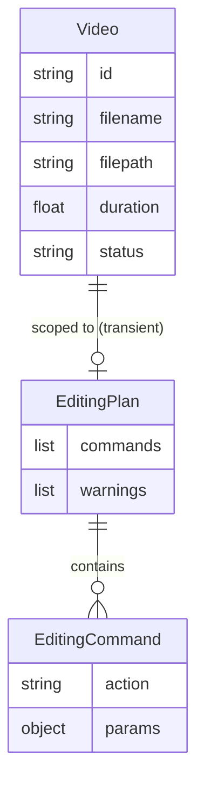

# REASONS Canvas: AI Editing Assistant
Date: 2026-07-18
Analysis: 2026-07-18-ai-editing-assistant-analysis.md
Scope: full-stack

---

## R — Requirements

**Problem:** Users must manually decide which edits to apply (silence removal, filler removal, export settings) with no guidance. There is no way to describe an editing intent in plain language and get back a structured, reviewable plan before committing to any processing.

**Goal:** A video creator can type a natural language prompt scoped to a selected video, have Ollama (Qwen3) return a structured editing plan via SSE streaming, and review the validated plan as a numbered step list — with no edits executed until Story 10.

**Definition of Done:**
- [ ] Given a video is selected and the user submits a prompt, when the request reaches the backend, then Ollama is called via `/api/chat` and its response is streamed back as SSE delta events
- [ ] Given Ollama returns a complete response containing valid JSON, when the backend accumulates and validates it against the EditingPlan schema, then a terminal `plan` SSE event is emitted containing the validated commands and any warnings
- [ ] Given the frontend receives the terminal plan event, when rendering completes, then each command is shown as a numbered human-readable step (e.g. "Step 1: Remove silence segments")
- [ ] Given Ollama returns malformed or non-JSON output, when validation fails, then the backend emits a terminal `error` SSE event and the frontend shows a clear message asking the user to rephrase
- [ ] Given the plan contains an action type not in the V1 schema, when validation runs, then the unknown command is silently dropped and its name appears in the warnings list shown to the user
- [ ] Given Ollama is offline when the request is made, when the backend catches the connection error, then the frontend shows "AI service unavailable — is Ollama running?"
- [ ] Given a valid plan is displayed, when the user takes no further action, then no video processing of any kind occurs
- [ ] Given a plan generation is already in progress for a video, when a second request arrives for the same video, then the backend returns 409 Conflict
- [ ] Backend tests written and passing with target coverage greater than 96 percent quality score
- [ ] No regression in transcription, subtitle, silence, or filler flows

---

## E — Entities

### Data Entities

No new database tables. The plan is transient — it lives in the SSE stream and then in React component state only. Story 10 will own persisting an accepted plan.

| Entity | Type | Key Fields | Relationships |
|--------|------|-----------|---------------|
| Video | Existing ORM model | id, filename, filepath, duration, status | Referenced for video lookup and metadata; unmodified |
| EditingCommand | Transient Pydantic response model | action (one of: remove_silence, remove_fillers, export), params (optional key-value pairs) | Part of EditingPlan; not persisted |
| EditingPlan | Transient Pydantic response model | commands (list of EditingCommand), warnings (list of stripped action names) | Emitted in terminal SSE plan event; not persisted |
| PlanRequest | Pydantic request body | prompt (non-empty string, max 500 chars) | Input to the plan endpoint |

### Frontend Artifacts

| Name | Type | Path | Responsibility |
|------|------|------|----------------|
| AssistantPanel.tsx | New React component | frontend/src/components/library/ | Prompt textarea, submit button, streaming token display, numbered plan list, error state; all local state owned here |
| streamEditingPlan() | New async generator function | frontend/src/api/client.ts | POSTs prompt to assistant/plan, reads ReadableStream line by line, yields typed PlanStreamEvent objects |
| EditingCommand | New TypeScript type | frontend/src/types/index.ts | action union + optional params; mirrors backend Pydantic model |
| EditingPlan | New TypeScript type | frontend/src/types/index.ts | commands array + warnings array; shape of the terminal plan event payload |
| PlanStreamEvent | New TypeScript discriminated union type | frontend/src/types/index.ts | Three variants: delta (content string), plan (commands + warnings), error (message string) |
| VideoCard.tsx | Modified existing component | frontend/src/components/library/ | Add assistantError state, import and render AssistantPanel after FillerPanel block |

---

## A — Approach

**Pattern:** FastAPI StreamingResponse (SSE) backed by httpx.AsyncClient streaming from Ollama /api/chat; React fetch + ReadableStream async generator consumed by local useState/useEffect in AssistantPanel

**Strategy:** The backend calls Ollama's chat endpoint with a system prompt that embeds the V1 command schema and requests JSON-only output, using Ollama's built-in format:json mode to bias the model. Raw token chunks are relayed immediately as delta SSE events so the user sees the model thinking in real time. Once the stream closes, the accumulated text is parsed and validated with Pydantic; a single terminal plan or error event is emitted. The frontend drives the entire SSE lifecycle from a useEffect with an AbortController — no React Query mutation, since the flow is multi-event rather than a single resolved promise.

**Scope In:**
- POST endpoint at /api/v1/videos/{video_id}/assistant/plan accepting a plain text prompt
- Ollama /api/chat call with system prompt containing the V1 schema definition
- SSE stream: delta events (token chunks) followed by one terminal plan or error event
- Pydantic validation of accumulated JSON; extra fields dropped silently with warnings collected
- AssistantPanel component rendered inside VideoCard when video status is ready
- Human-readable label mapping for each V1 action type
- AbortController cleanup on panel unmount

**Scope Out:**
- Executing the editing plan — Story 10
- Persisting the plan to the database — Story 10
- Multi-turn conversation or chat history — single prompt to plan for V1
- Custom or user-defined command types beyond remove_silence, remove_fillers, export
- Voice input for prompts
- Including video transcript or silence detection results in the Ollama prompt context

---

## S — Structure

### API Structure

**Module:** `app/api/v1/assistant.py` and `app/services/assistant.py` and `app/schemas/assistant.py`

**API Endpoint:**
- Method: POST
- Path: `/api/v1/videos/{video_id}/assistant/plan`
- Auth: none (same as all existing endpoints)
- Response: StreamingResponse with media_type text/event-stream

**New Files:**
- `backend/app/schemas/assistant.py` — EditingCommand, EditingPlan, PlanRequest Pydantic models
- `backend/app/services/assistant.py` — AssistantService.generate_plan() async generator; Ollama call, delta relay, JSON accumulation, validation, terminal event emission
- `backend/app/api/v1/assistant.py` — POST router; _in_flight guard; VideoService lookup; StreamingResponse wrapping the generator; 503 on ConnectError

**Modified Files:**
- `backend/app/main.py` — import assistant router; add include_router call with prefix /api/v1/videos

**Database:** None — no new tables or columns

### Frontend Structure

**Module directory:** `frontend/src/`

**New Files:**
- `frontend/src/components/library/AssistantPanel.tsx` — prompt input, streaming display, plan list, error state; receives videoId as prop; owns all local state

**Modified Files:**
- `frontend/src/types/index.ts` — add EditingCommand, EditingPlan, PlanStreamEvent types
- `frontend/src/api/client.ts` — add streamEditingPlan(videoId, prompt, signal) async generator
- `frontend/src/components/library/VideoCard.tsx` — add assistantError state; import AssistantPanel; render after FillerPanel block under video.status === "ready" guard; add assistantError to existing error display block

---

## O — Operations

1. [BE] Create `backend/app/schemas/assistant.py` — define PlanRequest with a non-empty prompt field capped at 500 characters; define EditingCommand with action as a Literal of the three V1 values and an optional params dict; define EditingPlan with a commands list and a warnings string list; set extra equals ignore on EditingCommand so unknown actions are dropped rather than raising a validation error

2. [BE] Create `backend/app/services/assistant.py` — define SYSTEM_PROMPT as a module-level constant that instructs Qwen3 to return only a JSON object matching the EditingPlan schema, shows a one-example schema shape, and forbids prose or markdown fences; define AssistantService with an async generator method generate_stream that opens an httpx.AsyncClient, posts to settings.ollama_base_url/api/chat with format json and stream true, yields each token chunk as a formatted SSE delta line, accumulates the full response text, strips any residual markdown fences, parses the JSON, validates against EditingPlan while collecting the names of any dropped unknown actions into warnings, then yields a terminal plan SSE line; catches json.JSONDecodeError and ValidationError to yield a terminal error SSE line; catches httpx.ConnectError to yield a 503 error SSE line

3. [BE] Create `backend/app/api/v1/assistant.py` — define module-level _in_flight set; define POST route at /{video_id}/assistant/plan that accepts PlanRequest body; returns 409 if video_id is in _in_flight; calls VideoService.get_by_id for the 404 guard; adds video_id to _in_flight; returns StreamingResponse wrapping AssistantService.generate_stream with media_type text/event-stream; removes video_id from _in_flight in a try/finally

4. [BE] Modify `backend/app/main.py` — import assistant from app.api.v1; add app.include_router(assistant.router, prefix="/api/v1/videos", tags=["assistant"]) after the fillers router registration

5. [FE] Modify `frontend/src/types/index.ts` — add EditingCommand interface with action as a union of the three string literals and optional params as Record of string to unknown; add EditingPlan interface with commands array and warnings string array; add PlanStreamEvent as a discriminated union of three object shapes keyed by the type field: delta with content string, plan with commands and warnings, error with message string

6. [FE] Modify `frontend/src/api/client.ts` — add async generator function streamEditingPlan that accepts videoId, prompt, and an AbortSignal; posts to BASE_URL/api/v1/videos/videoId/assistant/plan with the prompt in the JSON body and the signal attached; obtains a ReadableStream reader; reads chunks with TextDecoder; splits on newline pairs to extract SSE data lines; strips the leading data: prefix; skips lines that are not valid JSON; parses each line into a PlanStreamEvent and yields it; closes the reader on completion or abort

7. [FE] Create `frontend/src/components/library/AssistantPanel.tsx` — accept videoId as a prop; own local state for prompt string, streamingText accumulator, plan (EditingPlan or null), isStreaming boolean, and error string or null; render a textarea for the prompt and a submit button disabled while streaming or when prompt is empty; on submit create an AbortController, set isStreaming true, clear previous plan and error, iterate over streamEditingPlan yielding events: on delta append content to streamingText, on plan set plan state and clear streamingText, on error set error state and clear streamingText; always set isStreaming false in a finally block; while streaming show streamingText in a pre block; once plan is set show a numbered ordered list where each item maps the action to a human label using a lookup object (remove_silence maps to Remove silence segments, remove_fillers maps to Remove filler words, export maps to Export video) and appends params as a parenthetical if present; show warnings if any; show error message if error state is set; clean up the AbortController in the useEffect return

8. [FE] Modify `frontend/src/components/library/VideoCard.tsx` — import AssistantPanel; add assistantError state as string or null; add the AssistantPanel element after the FillerPanel block inside the video.status equals ready guard, passing videoId and an onError callback that sets assistantError; add assistantError to the existing bottom error display block alongside fillerError and silenceError

9. [BE] Create `backend/tests/test_assistant.py` — TestAssistantPlan class: test 404 for unknown video, test 409 when video_id is already in _in_flight, test successful SSE stream returns delta events followed by a terminal plan event (mock httpx.AsyncClient stream to return a valid JSON chunk), test malformed JSON from Ollama yields a terminal error event, test unknown action type in Ollama response is dropped and appears in warnings, test Ollama ConnectError yields a 503 error event; TestAssistantSchemas class: test EditingCommand drops extra fields silently, test PlanRequest rejects empty prompt

---

## N — Norms

### API Norms

- Service classes live in `app/services/` — routers call services, services own all business logic; no business logic in router functions
- Pydantic v2: use `model_config = ConfigDict(from_attributes=True)` for ORM-backed schemas; use `ConfigDict(extra="ignore")` to drop unknown fields on inbound or LLM-generated data
- All I/O is async: use `async def` and `await` throughout; never `subprocess.run` in async context — use `asyncio.create_subprocess_exec` or `asyncio.to_thread` for blocking calls
- `httpx.AsyncClient` for all outbound async HTTP; `httpx.Client` only for synchronous one-shot calls such as health checks
- Module-level `_in_flight: set` guard in every router file that handles stateful long-running operations — return 409 if already in flight; use try/finally to always discard
- Python 3.9 syntax only: `Optional[X]` and `List[X]` from typing; `Literal` from typing; `(str, Enum)` not `StrEnum`; no `X | Y` union syntax in type annotations
- Logging via `logging.getLogger(__name__)` — no print statements
- All new routers registered in `app/main.py` lifespan; router prefix follows existing `/api/v1/videos` pattern
- No hardcoded URLs or model names — all config via `settings` (pydantic-settings)

### Frontend Norms

- All API functions exported from `frontend/src/api/client.ts`; all shared types in `frontend/src/types/index.ts`
- Panel components follow the FillerPanel props contract: receive data and callbacks as props; own no internal API calls; pure display plus local UI state
- Use `useMutation` for one-shot POST actions; use `useState` plus `useEffect` with `AbortController` for streaming or multi-event flows — SSE is not a mutation
- `useQueryClient().invalidateQueries` after mutations that change the video list — never splice arrays manually
- `AbortController` required for any long-running fetch; always call `reader.cancel()` or `controller.abort()` in the `useEffect` cleanup return to prevent memory leaks on unmount
- No raw JSON, action type strings, or technical identifiers shown to users — all action types map to human-readable labels via a lookup object
- Error states must always be shown explicitly — no silent swallowing of failed SSE streams or parse errors

---

## S — Safeguards

### API Safeguards

- Never write to the database in Story 9 — the plan is transient; no migration, no model column, no DB insert
- Never break existing API contracts — all existing endpoints (/silence, /fillers, /transcriptions, etc.) must remain unmodified
- All new endpoints must have backend tests with greater than 96 percent quality score
- The _in_flight guard must be in a try/finally block — a crash during streaming must still discard the video_id from the set
- Never expose raw Ollama error bodies or stack traces to the client — wrap in a generic error message in the SSE error event
- Never log or expose the full prompt text at INFO level — log only video_id and prompt length
- Catch `httpx.ConnectError` specifically for the Ollama-offline case; do not swallow other httpx errors silently

### Frontend Safeguards

- The streaming textarea and plan view are display-only — no button or action in AssistantPanel may trigger video processing
- Disable the submit button while isStreaming is true to prevent duplicate concurrent requests
- Always cancel the AbortController in the useEffect cleanup to close the SSE connection if the component unmounts mid-stream
- Show all three UI states explicitly: streaming (token accumulator visible), plan ready (numbered list visible), error (message visible) — never leave the panel in a blank intermediate state
- Warnings from the plan event must be surfaced to the user — do not silently discard the warnings array
- Do not render raw JSON from the plan event — always map through the label lookup object before display

### Feature-Specific Safeguards (from analysis risks)

- Qwen3 may return markdown-fenced JSON despite format:json mode — strip triple-backtick fences and the json language tag before attempting JSON.parse in AssistantService
- If the accumulated response is empty after stripping (model returned only whitespace), emit a terminal error event rather than attempting to parse
- Set a total timeout of 60 seconds on the httpx.AsyncClient for the Ollama call — prevent indefinite hang if the model stalls

---

## Change Log

[Appended by /prompt-update and /sync]
