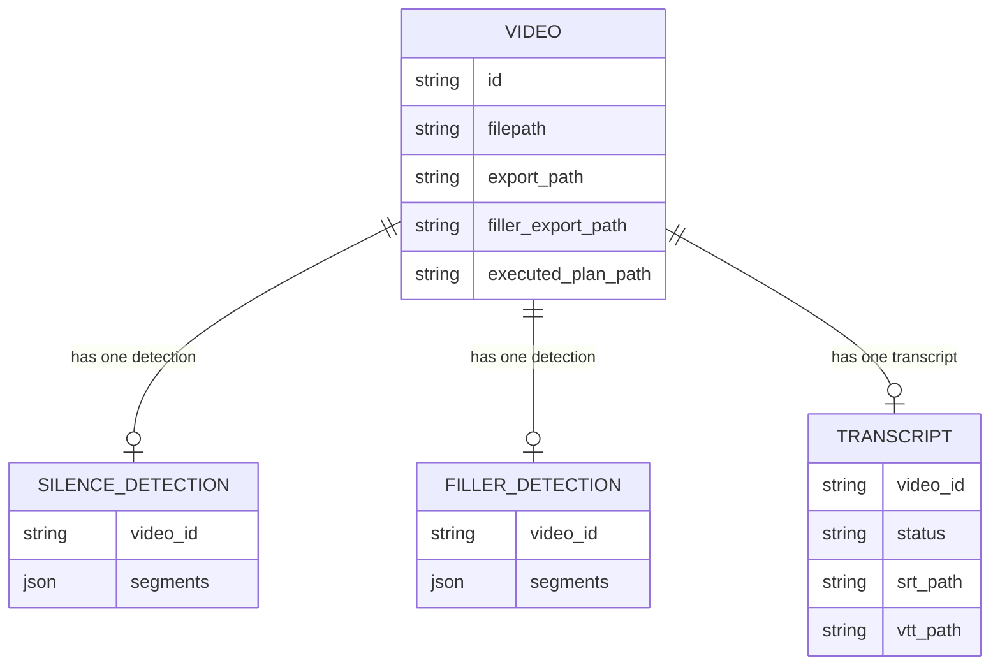

# REASONS Canvas: Execute AI Editing Plan
Date: 2026-07-22
Analysis: 2026-07-22-execute-ai-editing-plan-analysis.md
Scope: full-stack

---

## R — Requirements

**Problem:** The AI assistant generates an editing plan with a list of commands, but those commands are never executed — the AssistantPanel currently shows a static placeholder "Execution coming in a future update." The video creator must manually run silence removal, filler removal, and subtitle generation as separate UI actions.

**Goal:** Add a sequential plan executor that reads the AI-generated command list and dispatches each command to the appropriate existing service, streaming per-step progress to the frontend via SSE, and persisting the final edited video path to the database.

**Definition of Done:**
- [ ] Given a video exists and an EditingCommand list is posted to `/api/v1/videos/{id}/execute-plan`, when the request is valid, then the server returns a streaming text/event-stream response with status 200 and cache-control: no-cache
- [ ] Given the command list includes `remove_silence`, when the executor reaches that step, then SilenceService.remove is called and a progress SSE event is emitted with action, step index, total, and status done
- [ ] Given the command list includes `remove_fillers`, when the executor reaches that step, then FillerService.remove is called and a progress SSE event is emitted
- [ ] Given the command list includes `generate_subtitles`, when the executor reaches that step, then SubtitleService.generate is called and a progress SSE event is emitted
- [ ] Given all commands complete successfully, when the final step finishes, then a terminal done SSE event is emitted containing the executed_plan_path URL and the path is persisted to the Video record
- [ ] Given a command fails (e.g. no prior silence detection, FFmpeg error), when the exception is caught, then a terminal error SSE event is emitted with the failed action name and detail message, and execution halts
- [ ] Given the command list contains an export command, when the executor encounters it, then a warning SSE event is emitted stating export is not yet supported, and execution continues to the next command
- [ ] Given an execute-plan request is already in-flight for a video, when a second request arrives for the same video, then the server returns 409 Conflict
- [ ] Given the video ID does not exist, when POST /execute-plan is called, then the server returns 404 Not Found
- [ ] Given the request body contains an empty commands array, when POST /execute-plan is called, then the server returns 422 Unprocessable Entity
- [ ] Given the frontend has received a completed AI editing plan, when the plan is displayed, then an Execute Plan button appears below the plan command list
- [ ] Given the user clicks Execute Plan, when the SSE stream starts, then the button is disabled and a step list appears with each command shown as pending, updating to running then done or error
- [ ] Given all steps complete, when the terminal done event arrives, then a Download Edited Video link appears pointing to the executed_plan_path URL
- [ ] Given `generate_subtitles` is a new valid action, when the AI assistant generates a plan, then the Ollama prompt and KNOWN_ACTIONS include it and the frontend ACTION_LABELS map renders a readable label for it
- [ ] All 147 existing tests still pass after the migration guard and schema changes are applied

---

## E — Entities

### Data Entities

| Entity | Type | Key Fields | Relationships |
|--------|------|-----------|---------------|
| Video | Existing model — modified | id, filename, filepath, status, export_path, filler_export_path, executed_plan_path (new) | — |
| EditingCommand | Existing Pydantic schema — modified | action (Literal expanded to include generate_subtitles), params | contained in ExecutePlanRequest |
| ExecutePlanRequest | New Pydantic schema | commands (list of EditingCommand, min length 1) | — |
| SilenceDetection | Existing model — read only | video_id, segments | belongs to Video |
| FillerDetection | Existing model — read only | video_id, segments | belongs to Video |
| Transcript | Existing model — read only | video_id, status, srt_path, vtt_path | belongs to Video |

### Frontend Artifacts

| Name | Type | Path | Responsibility |
|------|------|------|----------------|
| AssistantPanel | Existing component — modified | components/library/AssistantPanel.tsx | Add Execute button, isExecuting state, executionSteps state, executedPlanUrl state, progress step list, download link, generate_subtitles ACTION_LABELS entry |
| client.ts | Existing API client — modified | api/client.ts | Add streamExecutePlan SSE generator function |
| types/index.ts | Existing type file — modified | types/index.ts | Add generate_subtitles to EditingCommand action union; add ExecutePlanStreamEvent discriminated union |

---

## A — Approach

**Pattern:** FastAPI SSE StreamingResponse + async generator service + React SSE consumer via fetch ReadableStream

**Strategy:** The execute-plan endpoint reuses the SSE pattern already established in the assistant endpoint — a StreamingResponse wraps an async generator guarded by the module-level `_in_flight` set with `finally` cleanup. A new ExecutePlanService.execute async generator iterates the command list and dispatches each recognised action to the existing SilenceService.remove, FillerService.remove, or SubtitleService.generate. Every dispatch is individually wrapped in try/except so a service-level failure becomes an error SSE event rather than an unhandled exception. The subtitle generation logic must first be extracted from the inline route handler in subtitles.py into a proper SubtitleService.generate class method before this orchestrator can call it. On the frontend, AssistantPanel gains a second async SSE loop triggered by the Execute button, using the identical fetch ReadableStream pattern as streamEditingPlan, with execution state kept entirely separate from plan-generation state.

**Scope In:**
- New POST /api/v1/videos/{id}/execute-plan endpoint with SSE progress stream
- Sequential execution of remove_silence, remove_fillers, generate_subtitles commands
- executed_plan_path column added to Video via migration guard
- generate_subtitles added to EditingCommand.action Literal, KNOWN_ACTIONS, SYSTEM_PROMPT, and frontend ACTION_LABELS
- SubtitleService.generate extracted from inline subtitles.py handler
- Frontend Execute button, progress step list, and download link in AssistantPanel
- ExecutePlanStreamEvent type and streamExecutePlan client function

**Scope Out:**
- export action execution (Story 8 not yet built — emits warning and continues)
- Parallel or concurrent command execution
- Undo or rollback of an executed plan
- Chaining step outputs — all steps operate on the original video.filepath, not on a prior step's export
- Re-executing a subset of commands
- Any UI outside of AssistantPanel (VideoCard, LibraryPage do not change)

---

## S — Structure

### API Structure

**Module:** `backend/app/`

**API Endpoint:**
- Method: POST
- Path: `/api/v1/videos/{video_id}/execute-plan`
- Auth: none (same as all existing endpoints)
- Response: text/event-stream with cache-control: no-cache and X-Accel-Buffering: no

**New Files:**
- `backend/app/schemas/execute_plan.py` — ExecutePlanRequest schema (commands list with min_length validation)
- `backend/app/services/execute_plan.py` — ExecutePlanService with execute async generator
- `backend/app/api/v1/execute_plan.py` — FastAPI router with POST endpoint, _in_flight guard, StreamingResponse

**Modified Files:**
- `backend/app/models/video.py` — add executed_plan_path Mapped Optional str column
- `backend/app/schemas/assistant.py` — add generate_subtitles to EditingCommand.action Literal
- `backend/app/services/assistant.py` — add generate_subtitles to KNOWN_ACTIONS frozenset and SYSTEM_PROMPT string
- `backend/app/services/subtitle.py` — extract generate logic into SubtitleService.generate classmethod; update route handler to call it
- `backend/app/api/v1/subtitles.py` — update generate_subtitles route handler to delegate to SubtitleService.generate
- `backend/app/main.py` — add _migrate_executed_plan_column guard in lifespan; import and include_router for execute_plan

**Database:**
- New migration guard: _migrate_executed_plan_column adds executed_plan_path TEXT column to videos table using the idempotent try/except OperationalError pattern established in main.py

### Frontend Structure

**Module directory:** `frontend/src/`

**New Files:**
- None — all changes are modifications to existing files

**Modified Files:**
- `frontend/src/types/index.ts` — add generate_subtitles to EditingCommand action union; add ExecutePlanStreamEvent discriminated union covering progress, done, error, warning variants
- `frontend/src/api/client.ts` — add streamExecutePlan async generator function
- `frontend/src/components/library/AssistantPanel.tsx` — add generate_subtitles to ACTION_LABELS; add isExecuting, executionSteps, executedPlanUrl, executionError state; add Execute button; add progress step list; add download link; add abortExecuteRef for cancellation

---

## O — Operations

1. [BE] Add executed_plan_path as a Mapped Optional str column to the Video ORM model in models/video.py, following the same pattern as the existing filler_export_path nullable column

2. [BE] Add _migrate_executed_plan_column function to main.py that issues ALTER TABLE videos ADD COLUMN executed_plan_path TEXT wrapped in try/except OperationalError; call it in the lifespan function after the existing _migrate_filler_columns call

3. [BE] Add generate_subtitles to the EditingCommand.action Literal in schemas/assistant.py; add generate_subtitles to the KNOWN_ACTIONS frozenset in services/assistant.py; add generate_subtitles to the valid actions list in the SYSTEM_PROMPT string in services/assistant.py with a brief description matching the existing style

4. [BE] Extract the subtitle generation logic from the generate_subtitles route handler in api/v1/subtitles.py into a new SubtitleService.generate classmethod in services/subtitle.py; the method receives video_id and db session, performs the completed-transcript lookup, 409 check, file writing, and db commit, and returns a dict with srt_url and vtt_url; update the route handler to call SubtitleService.generate and return its result

5. [BE] Create schemas/execute_plan.py with ExecutePlanRequest as a Pydantic BaseModel containing a commands field typed as List of EditingCommand with a minimum length of 1 enforced via Field(min_length=1)

6. [BE] Create services/execute_plan.py with ExecutePlanService containing an execute classmethod that is an async generator accepting commands, video object, and db session; the generator iterates commands in order, emits a started progress SSE event before each dispatch and a done progress SSE event after; dispatches remove_silence to SilenceService.remove, remove_fillers to FillerService.remove, generate_subtitles to SubtitleService.generate, and export to a warning event that continues without halting; wraps each dispatch in try/except to catch HTTPException and emit a terminal error SSE event with the failed action and detail, then return; after all commands complete, sets video.executed_plan_path to the last export URL produced (falling back to the video filepath if no removal was executed), commits the db, and yields a terminal done SSE event containing the executed_plan_path URL

7. [BE] Create api/v1/execute_plan.py with a FastAPI APIRouter, a module-level _in_flight set, and a POST /{video_id}/execute-plan route handler that checks the _in_flight guard and returns 409 if hit, calls VideoService.get_by_id for the 404 check, parses the request body as ExecutePlanRequest, adds video_id to _in_flight, returns a StreamingResponse wrapping an async generator that calls ExecutePlanService.execute and clears _in_flight in a finally block; sets media_type to text/event-stream and headers Cache-Control no-cache and X-Accel-Buffering no

8. [BE] Register the execute_plan router in main.py by importing execute_plan from app.api.v1 and adding app.include_router with prefix /api/v1/videos and tag execute-plan, following the existing router registration order

9. [FE] In types/index.ts, add generate_subtitles to the EditingCommand action union string literal; add ExecutePlanStreamEvent as a new exported discriminated union covering four variants: progress with fields step number, total number, action string, and status of started or done or error; done with executed_plan_path string; error with action string and detail string; warning with action string and detail string

10. [FE] In api/client.ts, add a streamExecutePlan async generator function that accepts videoId string, commands array of EditingCommand, and an AbortSignal; the function posts to /api/v1/videos/{videoId}/execute-plan with the commands in the request body and an application/json content-type header; reads the response body using the identical ReadableStream TextDecoder loop already present in streamEditingPlan; parses each data: line as an ExecutePlanStreamEvent and yields it; handles non-ok responses by reading the error JSON and throwing with the detail message

11. [FE] In components/library/AssistantPanel.tsx, add generate_subtitles entry to the ACTION_LABELS constant with label Generate subtitles; add isExecuting boolean state, executionSteps state as an array of objects each with action string and status of pending or running or done or error, executedPlanUrl nullable string state, executionError nullable string state, and abortExecuteRef as a second AbortController ref; replace the placeholder paragraph "Plan ready for review. Execution coming in a future update." with: an Execute Plan button that is disabled when isStreaming or isExecuting is true and calls a handleExecute function; a step list rendered when executionSteps is non-empty showing each step with an icon or indicator for its status; a download anchor tag rendered when executedPlanUrl is non-null pointing to the executedPlanUrl with the text Download Edited Video; the handleExecute function initialises executionSteps from plan.commands with all statuses set to pending, starts the abortExecuteRef controller, calls streamExecutePlan, updates executionSteps on each progress event by matching action and setting status, sets executedPlanUrl on the done event, sets executionError on the error event, and clears isExecuting in a finally block

12. [BE] Create backend/tests/test_execute_plan.py with at minimum 18 tests grouped into classes: TestExecutePlanEndpoint covering the 200 SSE response and cache-control header, the 409 in-flight guard, the 404 unknown video, the 422 empty commands validation, and that the endpoint is correctly wired in main; TestExecutePlanCommands covering remove_silence command success with progress event, remove_fillers command success with progress event, generate_subtitles command success with progress event, export command emitting warning and continuing, unknown action emitting warning and continuing, single command then terminal done event, multiple commands in order; TestExecutePlanErrors covering silence removal failure emitting error event and halting, filler removal failure emitting error event and halting, subtitle generation failure emitting error event and halting, executed_plan_path persisted to db on success; TestExecutePlanSchemas covering valid request passes validation, empty commands list fails validation, commands list with one item passes, generate_subtitles is accepted as a valid action

---

## N — Norms

### API Norms

- FastAPI router pattern: one router per feature in app/api/v1/; each file exposes a single `router = APIRouter()` and is registered in main.py
- Service classes use classmethods only — no instance creation, no dependency injection containers
- All async subprocess work (FFmpeg) uses asyncio.create_subprocess_exec — never subprocess.run or subprocess.Popen
- Pydantic v2: use ConfigDict(from_attributes=True) for ORM schemas; use @field_validator with @classmethod decorator; use Field(...) for constraints
- SQLAlchemy 2.0 with Python 3.9: use Mapped[Optional[str]] for nullable ORM columns — never use X | None union syntax in model files
- SSE pattern: StreamingResponse wrapping an async generator function, media_type text/event-stream, headers Cache-Control no-cache and X-Accel-Buffering no; each event is a string starting with "data: " followed by a JSON payload and ending with double newline
- _in_flight guard: module-level set[str] in each API module, checked before starting work, cleared in a finally block inside the async generator — never cleared in the route handler itself
- Migration guard: _migrate_*_columns function in main.py wraps each ALTER TABLE statement in try/except OperationalError; called in the lifespan function in dependency order
- Model column imports: add new columns to models first, then create migration guard; init_db creates fresh tables for new installs while guards handle existing installs
- Ollama integration: never use format:json in request payload; use think:false to suppress Qwen3 thinking blocks; keep system prompts short with few-shot examples to stay within 3-5s CPU response time

### Frontend Norms

- TanStack Query for all server state mutations and queries — direct fetch is only used for SSE streams where TanStack Query does not support streaming
- SSE streams use fetch plus response.body.getReader plus TextDecoder — never use EventSource which does not support POST requests
- Every SSE stream must be paired with an AbortController cleaned up in a useEffect return or a finally block
- All component state is React useState — Zustand is reserved for global cross-component state already managed in LibraryPage
- Tailwind CSS utility classes only — no custom CSS files or inline style objects
- TypeScript strict mode: no implicit any; use explicit discriminated union types for all SSE event shapes
- Client functions in api/client.ts only — no fetch calls inside React components
- Never hardcode localhost URLs or port numbers — always use the BASE_URL constant from import.meta.env.VITE_API_URL with localhost fallback
- Action label maps (ACTION_LABELS) must be updated whenever the EditingCommand action union is extended — label and union must stay in sync

---

## S — Safeguards

### API Safeguards

- Never modify database schema without a migration guard — the idempotent try/except OperationalError pattern in main.py is the only approved migration mechanism for this project
- Never break existing API contracts — all nine existing endpoint paths, response shapes, and status codes remain unchanged
- All new endpoints must have integration tests using the session-scoped TestClient from conftest.py
- ExecutePlanService.execute must wrap every service dispatch individually in try/except — a single failing step must not propagate an unhandled exception that corrupts the SSE stream or leaves _in_flight in a stuck state
- _in_flight must be cleared in a finally block inside the async generator, never in the route handler — if the client disconnects the generator is cancelled and the finally block still runs
- Execution halts after the first error event — never attempt to continue past a failed step; previously completed steps remain persisted in the database
- The export action must never raise an exception — it must always emit a warning event and yield to the next command regardless of params
- SubtitleService.generate must preserve the existing 400 and 409 behaviour of the inline handler for all callers — the route handler test coverage in test_subtitles.py must still pass after extraction

### Frontend Safeguards

- isExecuting must gate the Execute button — double-clicks and re-submissions during an in-flight stream must be impossible
- abortExecuteRef must be cancelled in a useEffect cleanup return so that navigating away from the panel while execution is running cleans up the stream
- executionSteps must be pre-populated from plan.commands as all-pending before the SSE stream starts — the UI must never show a blank step list while events are arriving
- Network errors and non-ok responses from streamExecutePlan must surface as visible executionError messages — never swallow API errors silently
- The Download Edited Video link must only render when executedPlanUrl is non-null — never show a broken link or empty href
- generate_subtitles must be present in ACTION_LABELS before shipping — if the label map and the action union are out of sync TypeScript will error at compile time, catching the mistake before runtime

### Feature-Specific Safeguards

- generate_subtitles action in KNOWN_ACTIONS and SYSTEM_PROMPT must be added atomically with the Literal change in schemas/assistant.py — if the schema accepts the action but the prompt never suggests it, the AI will never include it in a plan
- SubtitleService.generate must handle the already-generated case (srt_path is not None) by raising HTTPException 409 — ExecutePlanService must catch this 409 and emit a warning event to skip gracefully rather than halting execution with an error
- All 147 existing tests must pass after main.py migration guard addition and schemas/assistant.py Literal change — run the full test suite before marking any operation step complete

---

## Change Log

- 2026-07-22: Initial canvas created from analysis 2026-07-22-execute-ai-editing-plan-analysis.md
