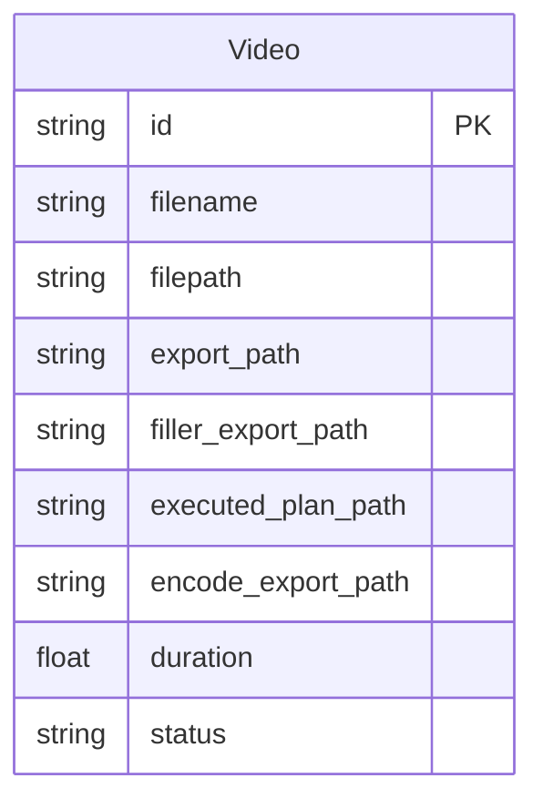

# REASONS Canvas: Export Video
Date: 2026-07-26
Analysis: analysis/2026-07-26-export-video-analysis.md
Scope: full-stack

---

## R — Requirements

**Problem:** The editor has no way to produce a final deliverable file. Users can detect silence, remove fillers, generate subtitles, and execute multi-step editing plans — but there is no export step that re-encodes the result into a distributable MP4. The AI assistant already lists "export" as an action but the service stub yields a warning and skips it.

**Goal:** Add an export endpoint that re-encodes the most-processed version of a video to H.264/AAC MP4 at a user-chosen resolution (720p or 1080p), streams real-time progress back to the browser via SSE, and serves the final file as a browser download. Wire the existing `export` action in `ExecutePlanService` to call the real service.

**Definition of Done:**
- [ ] Given a video exists, when the user POSTs `{"resolution": "720p"}` to `/api/v1/videos/{id}/export`, then the backend streams SSE `progress` events (0–100) followed by a `done` event containing a `download_url`
- [ ] Given a video exists, when the user POSTs `{"resolution": "1080p"}`, then the exported file is re-encoded at 1920×1080 with audio codec AAC and original audio bitrate preserved
- [ ] Given an export is already in progress for a video, when a second POST arrives, then the API returns 409 Conflict before starting any FFmpeg process
- [ ] Given an invalid or missing `resolution` value, when the user POSTs, then the API returns 422 with a descriptive validation error
- [ ] Given the `done` SSE event has been received, when the user clicks the download link, then the browser downloads the MP4 file (Content-Disposition: attachment)
- [ ] Given the FFmpeg process fails mid-encode, when the error occurs, then the SSE stream emits an `error` event with a human-readable message and the `_in_flight` guard is released
- [ ] 20+ tests passing, >96% Strong rating, no regression in existing 168 tests
- [ ] Frontend export panel manually verified: resolution picker, live progress bar, download link

---

## E — Entities

### Data Entities

| Entity | Type | Key Fields | Notes |
|--------|------|-----------|-------|
| `Video` | Existing ORM model | `encode_export_path TEXT nullable` (new column); `duration Float nullable` (used for progress calc); `executed_plan_path`, `filler_export_path`, `export_path`, `filepath` (source priority chain) | `export_path` must NOT be overwritten — silence removal stream reads it |
| `ExportRequest` | New Pydantic schema | `resolution: Literal["720p", "1080p"]` | Rejects unknown strings at schema boundary (422); no runtime string parsing needed |

### Frontend Artifacts

| Name | Type | Path | Responsibility |
|------|------|------|----------------|
| `ExportStreamEvent` | TypeScript discriminated union | `src/types/index.ts` | Three variants: `progress` (percent: number), `done` (download_url: string), `error` (message: string) |
| `Video` interface update | Type modification | `src/types/index.ts` | Add `encode_export_path: string \| null` field |
| `streamExport()` | Async generator function | `src/api/client.ts` | POST to `/export` with resolution; yields `ExportStreamEvent` via fetch + ReadableStream reader |
| `getExportDownloadUrl()` | Helper function | `src/api/client.ts` | Returns the download endpoint URL for a given video id |
| `ExportPanel.tsx` | New React component | `src/components/library/ExportPanel.tsx` | Resolution picker, Export button, ProgressBar (0–100), download anchor on done, error display |
| `VideoCard.tsx` | Modified component | `src/components/library/VideoCard.tsx` | Import and render `ExportPanel` when `video.status === "ready"` |

---

## A — Approach

**Pattern:** FastAPI SSE async generator (backend) + React async iterator consumer (frontend), following the execute-plan pattern already established in the codebase.

**Strategy:** The export endpoint mirrors `execute_plan.py` exactly — `POST /{id}/export` returns a `StreamingResponse` backed by an `_stream_with_cleanup` async generator that releases the `_in_flight` guard in `finally`. `ExportService.encode()` uses `asyncio.create_subprocess_exec` (not `to_thread`) to read FFmpeg stderr incrementally and emit `progress` SSE events computed from `time=HH:MM:SS.ms` against `video.duration`. A new `encode_export_path` column on `Video` stores the output path without touching `export_path`, which the silence removal stream endpoint still reads. The `ExportPanel` component follows `AssistantPanel` — `AbortController` ref, `for await` over the SSE generator, local state for progress and download URL.

**Scope In:**
- `POST /api/v1/videos/{id}/export` SSE endpoint (720p / 1080p resolution)
- `GET /api/v1/videos/{id}/export/download` attachment download endpoint
- FFmpeg H.264 video + AAC audio re-encode with aspect-ratio-preserving scale filter
- Real-time progress via FFmpeg stderr `time=` parsing (0–100 percent)
- `_in_flight` 409 guard; `encode_export_path` column on `Video`
- `ExecutePlanService` export branch wired to real service
- `ExportPanel` component in `VideoCard`

**Scope Out:**
- Other container/codec formats (WebM, MOV, H.265) — future story
- Custom bitrate or CRF quality controls — future story
- Audio-only export — future story
- Direct upload to YouTube or social media APIs — out of scope (local-first)
- Batch export of multiple videos — future story
- Subtitle burn-in export — future story

---

## S — Structure

### API Structure

**Module:** `backend/app/`

**API Endpoints:**
- `POST /api/v1/videos/{video_id}/export` — SSE StreamingResponse; body `{"resolution": "720p"|"1080p"}`
- `GET /api/v1/videos/{video_id}/export/download` — FileResponse; Content-Disposition: attachment

**New Files:**
- `app/schemas/export.py` — `ExportRequest` Pydantic model with `resolution: Literal["720p", "1080p"]`
- `app/services/export.py` — `ExportService.encode()` async generator; FFmpeg subprocess; progress parsing; `encode_export_path` update
- `app/api/v1/export.py` — FastAPI router; `_in_flight` set; `_stream_with_cleanup`; POST + GET handlers

**Modified Files:**
- `app/models/video.py` — add `encode_export_path: Mapped[Optional[str]]` column
- `app/main.py` — add `_migrate_encode_export_path_column()` startup migration; register export router
- `app/services/execute_plan.py` — replace export warning stub with real `ExportService.encode()` call; pass `resolution` from `cmd.params`

**Database:**
- `ALTER TABLE videos ADD COLUMN encode_export_path TEXT` — idempotent migration guard in `main.py`

### Frontend Structure

**Module directory:** `frontend/src/`

**New Files:**
- `src/components/library/ExportPanel.tsx` — resolution picker (select), Export button, ProgressBar, download anchor, error display

**Modified Files:**
- `src/types/index.ts` — add `ExportStreamEvent` discriminated union; add `encode_export_path: string | null` to `Video` interface
- `src/api/client.ts` — add `streamExport()` async generator; add `getExportDownloadUrl()` helper
- `src/components/library/VideoCard.tsx` — import `ExportPanel`; render in the panel section

---

## O — Operations

1. [BE] Add `_migrate_encode_export_path_column()` to `app/main.py` — wraps `ALTER TABLE videos ADD COLUMN encode_export_path TEXT` in try/except OperationalError; call it in `lifespan()` after the existing migrations

2. [BE] Add `encode_export_path: Mapped[Optional[str]]` to the `Video` ORM model in `app/models/video.py` — use `Optional[str]` from typing (not `str | None`, Python 3.9 constraint); nullable TEXT column

3. [BE] Create `app/schemas/export.py` — define `ExportRequest` Pydantic model with a single field `resolution` typed as `Literal["720p", "1080p"]`

4. [BE] Create `app/services/export.py` — define `ExportService` with an `encode()` async classmethod that: (a) selects source file via the priority chain `executed_plan_path → filler_export_path → export_path → filepath`; (b) maps resolution to FFmpeg scale filter using `-vf scale=-2:720` or `-vf scale=-2:1080` (negative-two preserves aspect ratio); (c) spawns FFmpeg with `asyncio.create_subprocess_exec` using `-c:v libx264 -c:a aac` and stderr=PIPE; (d) reads stderr lines incrementally in an async loop; (e) parses `time=HH:MM:SS.ms` from stderr and computes percent against `video.duration` (emit percent=-1 when duration is None); (f) yields `_sse({"type": "progress", "percent": N})` as progress arrives; (g) on process exit with returncode != 0, raises ValueError with the last 300 chars of stderr; (h) on success, updates `video.encode_export_path`, commits db, and yields `_sse({"type": "done", "download_url": "/api/v1/videos/{id}/export/download"})`

5. [BE] Create `app/api/v1/export.py` — module-level `_in_flight: set`; define `_stream_with_cleanup()` async generator (same try/finally guard as `execute_plan.py`); define `POST /{video_id}/export` handler: checks `_in_flight`, fetches video via `VideoService.get_by_id()`, adds to `_in_flight`, returns `StreamingResponse` with `media_type="text/event-stream"` and headers `Cache-Control: no-cache`, `X-Accel-Buffering: no`; define `GET /{video_id}/export/download` handler: fetches video, checks `encode_export_path` is set and file exists on disk (404 if not), returns `FileResponse` with `content_disposition_type="attachment"` and an `_export`-suffixed filename

6. [BE] Register export router in `app/main.py` — add import for `export` module; add `app.include_router(export.router, prefix="/api/v1/videos", tags=["export"])`

7. [BE] Update `app/services/execute_plan.py` export branch — replace the warning stub at the `elif action == "export":` block with an `async for chunk in ExportService.encode(video, resolution, db): yield chunk` call; extract `resolution` from `cmd.params.get("resolution", "1080p")` with a fallback of `"1080p"`; add the `ExportService` import at the top of the file

8. [FE] Update `src/types/index.ts` — add `encode_export_path: string | null` to the `Video` interface; add `ExportStreamEvent` discriminated union with three variants: `{ type: "progress"; percent: number }`, `{ type: "done"; download_url: string }`, `{ type: "error"; message: string }`

9. [FE] Update `src/api/client.ts` — add `streamExport()` async generator function that POSTs `{ resolution }` to `/api/v1/videos/${videoId}/export` and yields `ExportStreamEvent` using the same fetch + ReadableStream reader + buffer/split/parse pattern as `streamExecutePlan()`; add `getExportDownloadUrl()` function returning `${BASE_URL}/api/v1/videos/${videoId}/export/download`; import `ExportStreamEvent` from types

10. [FE] Create `src/components/library/ExportPanel.tsx` — functional component receiving `videoId: string` and `onError: (msg: string) => void`; local state: `resolution` (default `"1080p"`), `isExporting`, `progress` (number | null), `downloadUrl` (string | null), `error`; AbortController ref cleaned up on unmount; `handleExport()` drives the `for await` loop over `streamExport()`, setting progress on `progress` events, setting downloadUrl on `done`, setting error on `error`; renders a `<select>` for resolution, an Export button (disabled while exporting), `<ProgressBar>` when `isExporting` or `progress !== null`, a download `<a>` anchor when `downloadUrl` is set, and an error message

11. [FE] Update `src/components/library/VideoCard.tsx` — add `import ExportPanel from "@/components/library/ExportPanel"`; render `<ExportPanel videoId={video.id} onError={setAssistantError} />` in the panels section, conditionally shown when `video.status === "ready"`

12. [BE] Write `backend/tests/test_export.py` — four test classes: `TestExportService` (unit tests for source priority chain, resolution mapping, progress parsing, duration-None guard), `TestExportEndpoint` (POST 200 SSE stream, POST 404 unknown video, POST 409 in-flight, POST 422 invalid resolution, POST 422 missing resolution), `TestExportDownload` (GET 200 attachment disposition, GET 404 no encode yet, GET 404 file missing from disk), `TestExportExecutePlan` (export action via execute-plan with resolution param, export action without resolution param falls back to 1080p)

---

## N — Norms

### API Norms

- FastAPI router modules follow the pattern in `app/api/v1/` — one file per feature, one `router = APIRouter()`, module-level `_in_flight: set`
- All async operations use `asyncio.create_subprocess_exec` (not `subprocess.run` or `asyncio.to_thread`) when real-time output reading is required
- Pydantic v2: `model_config = ConfigDict(from_attributes=True)` for ORM schemas; `@field_validator` with `@classmethod`; `Literal[...]` for constrained string fields
- SQLAlchemy 2.0 Python 3.9: use `Mapped[Optional[str]]` from `typing`, never `Mapped[str | None]`
- New DB columns always guarded by `_migrate_*_column()` with `try/except OperationalError` — idempotent on every startup
- `VideoService.get_by_id()` raises `HTTPException(404)` — always call it first in route handlers
- `StreamingResponse` SSE headers: `Cache-Control: no-cache`, `X-Accel-Buffering: no`
- `_sse()` helper format: `f"data: {json.dumps(payload)}\n\n"`
- `_in_flight` guard: add before operation, release in `finally` block — never only on success
- File paths stored in DB as absolute strings; resolved via `Path(video.encode_export_path)` in route handlers

### Frontend Norms

- Async generator SSE consumers use `fetch` + `response.body.getReader()` + `TextDecoder` + buffer/split/parse — never `EventSource` (POST not supported)
- All SSE generator functions accept an `AbortSignal` and cancel the reader in the `finally` block
- Components consuming SSE own an `AbortController` ref; clean up via `useEffect` return
- TypeScript discriminated unions for all SSE event shapes — never `any`
- `ProgressBar` component from `src/components/common/` for all progress displays — no inline progress markup
- Button disabled state during async operations; `AbortController.abort()` on component unmount
- Tailwind utility classes only — no inline styles

---

## S — Safeguards

### API Safeguards

- Never overwrite `video.export_path` in `ExportService` — write only to `video.encode_export_path`; the silence removal stream reads `export_path` and must not be broken
- Use `asyncio.create_subprocess_exec` with `stderr=asyncio.subprocess.PIPE` — never `asyncio.to_thread(subprocess.run)` for progress-streaming operations
- Always guard against `video.duration is None` when computing progress percent — emit `percent: -1` rather than dividing by zero
- Use `-vf scale=-2:HEIGHT` FFmpeg scale filter (not `scale=WIDTH:HEIGHT`) to preserve the original video's aspect ratio
- `_in_flight` guard must be released in a `finally` block — not just on success paths
- All new API endpoints must have feature tests before merging
- Do not log or expose the full absolute file path in user-facing error messages

### Frontend Safeguards

- `streamExport()` must pass the `AbortSignal` and cancel the reader on abort — prevent dangling fetch connections on component unmount
- Show progress bar and disable Export button for the full duration of the SSE stream — prevent duplicate submits
- Surface every SSE `error` event to the user via the error state — never silently swallow encode failures
- `getExportDownloadUrl()` must return an absolute URL (with `BASE_URL` prefix) — the `<a href>` must be directly navigable, not a relative path
- Do not render the download anchor until the `done` event is received — a partial encode file must not be downloadable

---

## Change Log
